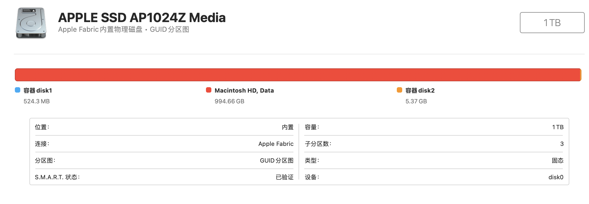
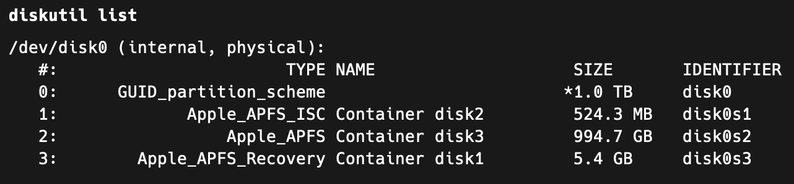
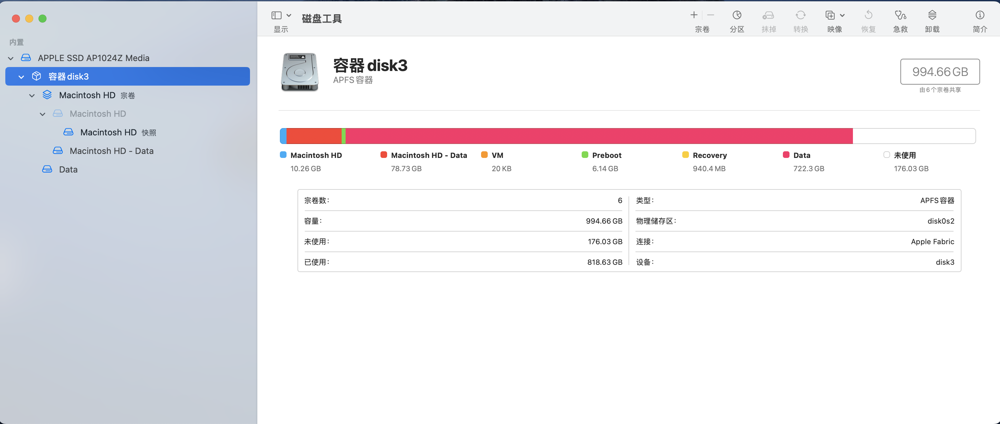
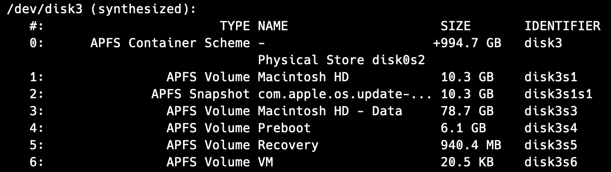

# 2022年

## 设备管理器里的“写入缓存策略”（8.29）

其中关闭设备上的Windows写入高速缓存缓冲区刷新是指: 开启硬盘缓存的前提下，每次当硬盘内的缓存写满，不进行清零刷新，而是直接覆盖。这样当异常断电时候，缓冲区可能有一部分是正常数据，另一部分是脏数据。这时候靠那点电容电量直接写入，可能会把脏数据写进入，导致文件损坏。而反过来说，不勾选这个的话，每次写完缓存都进行刷新，这样速度稍微慢一点点，但是异常断电时写入不会写入脏数据，比较安全。


## 双拼辅助码（9.17）

+ 微软不支持
+ 搜狗只有横竖撇捺乱搞
+ 小鹤输入法 例字: 球 qqwq 首形(王) 末形(求) 不错，不过没有自然码
+ 自然码输入法 例字: 癌 aibu 首形(疒) 末形(山) 不错，不过输入法落后
+ 手心输入法
  1. 辅助码用tab挺好，不过和自然码规则有些不一样
  2. 支持简拼！！！
  3. 样式比较新，完美


## SD卡（9.26）

+ 和SSD原理相同，有主控和闪存芯片，速度慢是因为体积有限，主控无法得到升级，不能实现复杂逻辑。
+ 除了最高端旗舰还在坚持用MLC，其余为了降低成本全部转为TLC。目前闪迪全系都是TLC。


## SSD寿命（9.30）

主要看CrystalDiskInfo的

1. 健康状态(对应下面已用寿命百分比)，这个百分比是通过P/E擦写次数(TLC擦写次数最高1000次P/E(Program/Erase Cycle 全盘擦写次数))内部计算而来的，比较准。:
2. 本机总计写入。一般保修是: 
   2T 1200TBW(TB Write)，
     1T 600TBW，
     512G 300TBW，
     256GB 150TBW，
     128GB 70TBW。
     已用TBW就是本机总计写入换算成TB。


## SSD暴力测试（9.30）

最拉的还属凯侠(699TBW)和金士顿(912TBW)
不过所有硬盘都撑过了600TBW


## Rust优缺点（10.5）

优点:

  + 性能高直逼c语言，直接编译为exe，大小很小
  + 自带函数式编程，方便快捷
  + 保证没有空指针，所有类型一定存在！
  + 错误(异常)处理很灵活！
  + 包管理非常优秀，开发者甚至可以发布自己的包(比Maven强)
  + 自带测试框架，特别在自制包中，测试非常便捷！
  + 函数/方法注释支持md格式，非常银性！ 


缺点:

  + 表达繁琐，充斥所有权管理
  + 缺乏反射(cpp也是)，代替者宏可读性和可调试性非常差
  + 比较适用于单线程编写，一个变量只能有1个可变引用！！！
  + 包目录管理一般，一般还需要写mod.rs，和py一个样


## 前端构建过程（10.11）

前端构建过程 = maven + 语法树优化 + 编译热更新就是
语法树优化 = 代码降级(babel) + ts, less解析(tsc -> js, less -> css) + 体积优化(uglifijs)


## 前端构建工具对比（10.11）

+ Webpack慢的原因
  1.  支持多种模块化语法(common js写法和es6写法可以混着写)，因此需要在启动项目的时候读取**所有**前端依赖，把所有js中的导入模块语句全部改成webpack_require()函数，很费时，但兼容性好。
  2.  解析依赖全部结束后才开服务器。

+ Vite快的原因
  1. 默认导入模块只使用es6 require语法(使用其他写法的，比如使用commonjs写法的axios，vite会提前用esbuild把它转化成es6依赖)，因此不需要读取所有依赖模块的js，是按需读取(只读取使用到的模块)，速度快。
  2. 先开启服务器后才解析依赖


## Vue组件的调用（10.12）

+ emit是子调父
+ props是父改子(子没有权利修改)
+ v-model是父子同深
  1. 其实是语法糖，详细写法是<input :value="?" @input="? = $event.target.value"/>。在组件上则是< :value="?" @input="? = $event     
  2. 原理是绑定input标签的value属性(内置属性props，存放input的值)绑定到?变量上。在触发input事件时，将value的值赋予?变量(子调父，从而父变化！！！)。在?变量改变时，因为props所以input的value也会跟着改变(父改子)。
  3. 在vue3中v-model必须写成v-model:子组件变量x来强调绑定哪个变量，使父组件变化的事件名称默认为update:子组件变量x，且v-model也可以省略。


## 了解vite build（10.13）

vite build: vue-tsc --noEmit && vite build意思:
vue-tsc表示编译所有ts文件，而--noEmit表示只编译不输出js文件
因此总体意思是vite编译前先检查ts语法，如果语法通过才能继续生成dist文件夹。


## Pinia优点（10.13）

+ 去除mutations
+ 去除嵌套模块
+ action无需dispatch，直接调用！
+ 更好地支持ts(vuex需要声明接口类型才能创建store)


## cjs和mjs的区别（10.20）

一个是commonjs require语法(不支持vite)，一个是es-module import语法(支持vite)


## Vite配置CDN（10.20）

需要引入es module类型的mjs，因此esm.sh的cdn为最佳


## Vite预构建（10.20）

Vite预构建(运行时/依赖改变时开始)的时候会将commonjs代码转化为esm代码，供浏览器执行。所以vite是在全esm环境下执行的。又因为现代浏览器原生支持执行esm代码并且，当浏览器每次import时: vite开了一个后端服务器按需为es模块进行内联整合再返回单模块，所以速度快。


## 前端对标Maven的探索（10.24，10.25）

+ Pnpm

​		软链接目录，硬链接所有文件(软链接兼容性不好，作者改成了硬链接)

​		垃圾，硬链接还是显示实际大小(观感不好)，还不能运行

+ Yarn plug-in-play

  采用和Maven一样的结构，大小小了，但生成的文件夹和文件太丑了，还不能运行


## 设备性能测试软件（10.27）

Cinebench是测试单核和多核cpu性能的重要软件
注: 在安卓最有名的是GeekBench，在PC最有名的是这个。


## 对比Intel 11th 和 12th（10.27）

+ 12th intel cpu比11th单核和多核性能同步提升20%

+ 12th intel cpu:

  + 使用intel 7工艺: 从11th的14nm改为10nm，单核性能提升20%
  + 使用大小核: 大核大小和原来的核一样，小核性能不低，和10th性能差不多，多核性能提高20%

  

## CPU参数（10.28）

+ 超线程: 增加5%晶体管，通过复制寄存器的方式，将1个物理核心变成2个逻辑核心，使其可以独立运行2个不同线程，而缓存是共享的。但由于2个逻辑核心可能同时访问同一个缓存中的资源而产生竞争，此时需要其中一个核心执行，另一个核心等待。这样的设计提高了闲置cpu的利用率，最后提升了30%的性能。
+ 超频: CPU频率=基本时钟速度(BCLK)x倍增系数(正整数)，一般是通过在BIOS增加倍增系数来提高CPU频率得到超过默认CPU频率的效果。这会带来性能的提升，而功耗也相应提升，需要更好的散热来压住，总体不好控制且不稳定。intel支持超频的cpu末尾带k或x。
+ CPU冷却:
  + 空气冷却: 通过在CPU和导热板间填充硅脂(导热膏)，把热量从CPU表面转移到导热板上，最后利用风扇降温。
  + 液体冷却: 通过导热膏，把热量转移到导热板上，导热板内有Z型管道，注入冷却液，通过水泵输出热的冷却液到散热板中冷却(一般会加装小功率风扇2个)，冷却后重新循环到cpu，反复如此。
+ 睿频: 在cpu负载增加时达到算法级别的自动超频效果。


## Apple M1 CPU（10.28）

+ intel x86采用的是复杂指令集(不定长，指令复杂，不同指令执行cpu时间不同)，执行前需要解码器翻译成简单指令集(定长，指令简单，执行cpu时间相同)。而arm采用的是简单指令集，和真正执行的指令集大致相同，执行前也需要翻译，但负担很小。因此arm比intel执行较快。
+ m1利用超大缓存(192KB，对比intel 32KB)和超大规模的解码器(8x，对比intel 1复杂+4简单x)，每个时钟周期发射的命令条数多(8个，对比intel 4个, amd 6个, 骁龙5个)，为cpu带来巨大的性能提升。
+ m1重排序缓冲区大(630ROB，对比 amd 256, intel 224, 骁龙 224)，乱序执行的指令执行完后需要经过重排序为原来的顺序最后写入寄存器，性能提升大。
+ m1架构为4大核4小核
+ gpu性能比intel 1185g7稍好
+ 功耗仅为24w和intel 1185g7相当
+ 自带视频解码器，播放视频时非常省电
+ 基础操作功耗低(有专门的处理单元)，续航很长


## Cookie和跨域（10.28）

Cookie属性：

+ Secure: 强制https才能传输此cookie
+ SameSite: 
  1. Strict: 跨站点时不允许设置cookie和携带目标域名cookie
  2. Lax: 默认，跨站点时仅允许get请求(a标签或者普通get表单，不允许ajax)设置cookie和携带目标域名cookie，这个可以很好的避免CSRF攻击，比如post请求的银行转账。
  3. None，跨站点时完全允许设置cookie和携带目标域名cookie，需要Secure为true
+ Domain: 决定cookie在哪个域名有效，一般以.开头，在指定域名下才可以访问到该cookie
+ Path: 决定cookie在哪个路径有效，必须以/开头，在指定地址下才能访问到该cookie，建立在Domain的基础上

跨域：

+ 跨端口但不跨域名
  前端: 设置withCredentials为true以允许请求时携带cookie
  后端:
    设置withCredentials为true以允许被请求时携带cookie
    设置allowOrigins为*或者某个域名以允许某域名进行跨域
+ 跨域名(前后端不同域名，多个后端实例同个域名)需要额外做的
  + cookie(注意以下操作可能会带来CSRF攻击，不推荐): 
    设置SameSite为None以允许跨域设置cookie和跨域携带cookie
    设置Secure(否则SameSite=None无效)
    设置Domain为后端地址的一段共有域名(否则访问不同后端地址cookie将会相互不可见，且无法携带)
    设置Path为/使得cookie对同一域名下所有路径可见
  + 获取cookie: 
    由于cookie严格按照域名被浏览器完全控制，js无法获取！不过可以在访问相关域名的时候携带这些cookies


## AMD处理器（10.29）

都是普通核，但是采用2个封装，每个封装8个核，一共16核32线程，性能不错


## Spring WebFlux（11.3）

+ 意义: 极大提高吞吐量(每秒请求多时提高巨大)，非常适合io阻塞多的情况。
+ 传统阻塞原理:
  对于传统服务器(tomcat)，每个线程对应一个请求，请求阻塞线程就阻塞，直到请求结束释放线程后，才能继续接受请求。
+ 非阻塞原理: 
  + 分离io操作
    遇到io操作时将正在阻塞的「请求线程」让出来，交给另一个「后台线程」执行io，阻塞的「请求线程」当即被释放，可以继续接受请求，而处理io的「后台线程」处理完就返回给服务器。这样你会发现「请求线程」始终不会产生阻塞，可以用非阻塞的方式不停地处理请求，极大提高了吞吐量。
+ 非阻塞支持
  + 非阻塞的服务器(Netty, Tomcat Servlet 3.1等)
  + 非阻塞的数据库(MongoDB等) (MySQL是阻塞式的，但是现在利用R2DBC项目，已经可以和WebFlux无缝对接了，而Mybatis官方还没整合R2DBC，第三方提供了整合, MybatisPlus还没人整合)


## 种子（p2p）

1. 原理

  + 下载
    把文件分成多段，通过解析用户ip地址，从用户的电脑上多线程下载文件
  + 上传
    把文件分为多段，下载完成后手动上传作为共享

2. 历史

  + BT 1.0
    torrent文件 里面存放trakers地址，每个地址对应一个服务器，里面存放不同资源文件段对应的用户ip地址，通过解析trackers，可以最终解析到做种用户的ip并下载。但是如果国内因为违规tracker服务器被封了，就联系不到用户下载了。
  + BT 2.0
    磁力链接 链接内容就是文件哈希值，下载时会不断地询问周围的p2p用户，每个用户相当于一个tracker服务器，手里拿着哈希值 -> ip地址的映射表，如果找不到目标ip那个用户就会问别的用户，以此扩散直到找到为止。这样真正地达到了废除tracker，去中心化的效果。

3. 生态

  + BT下载软件
    国内ipv4地址不够，大多都是公网ip，做种上传速度低，从而影响到用户下载速度。
  + 迅雷
    通过把种子文件的资源自动上传服务器，下载不做种或者只让做种在迅雷用户间生效却吸取其他p2p用户做种的资源，最后反复循环达到国内下载速度快的垄断效果。


## 超频SD卡（11.8）

通过将传输数据次数从每个时钟频率1次调整为2次来提高传输速度，本质还是uhs-i，并且只支持特定读卡器芯片，不支持任何设备卡槽。


## 固态缓存（11.11）

存放FTL表，是DRAM结构，索引文件速度快，而无缓存的固态FTL完全放在颗粒里或者内存里，索引速度相应比较慢。一般1G的颗粒容量应该对应1m的缓存，小于1m的只能存热门的文件索引，不好！ 当然有缓存发热量更高。


## SLC模拟（11.11, 11.12）

 写入放大，损耗SLC寿命，固定SLC模拟比全盘SLC模拟更优。

+ 大概10gb就够用了，缓外速度没啥关系。
+ 小于10gb的，考虑缓外速度。


## Dramless技术（11.11）

Dramless(无缓存，使用内存代替技术): 无法做到使用1GB内存模拟1GB缓存，性能比不上独立缓存，但是发热量比较小。还是带独立缓存的牛。


## SSD品牌及选购（11.12, 11.15, 11.18, 11.19, 11.20, 8.5）

品牌：

+ 致钛: 性能中规中矩，没多少黑料，价格偏贵。
+ 三星: ssd性能强劲，但是因为换了ssd生产材料出现了0e问题，波及几乎所有新生产的ssd，数据安全性堪忧，不建议选购。
+ 西数: 性能中规中矩，没什么黑料，价格实惠。
+ 东芝: 好的芯片都卖给别人了，自家的ssd寿命短，基本到保修的TBW就坏了，但是价格比较便宜。


选购（1TB）：

注意：SLC缓存测试为实际效果

+ 致钛:    

  + TiPlus5000

    + 协议: PCIE 3.0
    + 顺序读写: 3500R 3100W
    + 极限4K读写: 465KIOPS(1816MB/s)R 390KIOPS(1523MB/s)W
    + 独立缓存: 无
    + SLC缓存: 80GB，三段式2000MB(10%)/1000MB(83%)/250MB(7%)
    + 京东价格: 549元

    

  + PC005

    + 协议: PCIE 3.0
    + 顺序读写: 3500R 2900W
    + 极限4K读写: 330KIOPS(1289MB/s)R 360KIOPS(1406MB/s)W
    + 独立缓存: 1GB
    + SLC缓存: 11GB，两段式2000MB(1%)/750MB(99%)
    + 京东价格: 599元

    

  + TiPlus7100

    + 协议: PCIE 4.0

    + 顺序读写: 7000R 6000W

    + 极限4K读写: 900KIOPS(3515MB/s)R 700KIOPS(2734MB/s)W

    + 独立缓存: 无

    + SLC缓存: 160GB，三段式3000MB(18%)/2000MB(59%)/700MB(23%)

    + 京东价格: 629元

      

  + TiPlus7000 

    + 协议: PCIE 4.0

    + 顺序读写: 7400R 5400W

    + 极限4K读写: 830KIOPS(3242MB/s)R 1050KIOPS(4101MB/s)W

    + 独立缓存: 1GB

    + SLC缓存: 全盘模拟，三段式3000MB(35%)/1500MB(10%)/750MB(55%)

    + 京东价格: 739元

  

+ 三星:

  + 970 EVO Plus

    + 协议: PCIE 3.0
    + 顺序读写: 3500R 3300W
    + 极限4K读写: 600KIOPS(2343MB/s)R 550KIOPS(2148MB/s)W
    + 独立缓存: 1GB
    + SLC缓存: 115GB，两段式2500MB(12%)/850MB(88%)
    + 京东价格: 749元

    

  + 970 Pro (MLC)

    + 协议: PCIE 3.0

    + 顺序读写: 3500R 2700W

    + 极限4K读写: 500KIOPS(1953MB/s)R 500KIOPS(1953MB/s)W

    + 独立缓存: 1GB

    + SLC缓存: 无，全程2000MB/s

    + 京东价格: 2199元

  

  + 980

    + 协议: PCIE 3.0
    + 顺序读写: 3500R 3000W
    + 极限4K读写: 400KIOPS(1562MB/s)R 470KIOPS(1836MB/s)W
    + 独立缓存: 无
    + SLC缓存: 160GB，两段式1700MB(18%)/500MB(82%)
    + 京东价格: 599元

    

  + 980 Pro

    + 协议: PCIE 4.0
    + 顺序读写: 7000R 5000W
    + 极限4K读写: 1000KIOPS(3906MB/s)R 1000KIOPS(3906MB/s)W
    + 独立缓存: 1GB
    + SLC缓存: 115GB，两段式2400MB(12%)/2000MB(88%)
    + 京东价格: 799元

    

  + 990 Pro

    + 协议: PCIE 4.0
    + 顺序读写: 7450R 6900W
    + 极限4K读写: 1400KIOPS(5468MB/s)R 1550KIOPS(6054MB/s)W
    + 独立缓存: 1GB
    + SLC缓存: 115GB，两段式2950MB(12%)/1800MB(88%)
    + 京东价格: 999元

    

+ 西数:

  + SN750

    + 协议: PCIE 3.0
    + 顺序读写: 3470R 3000W
    + 极限4K读写: 515KIOPS(2011MB/s)R 560KIOPS(2187MB/s)W
    + 独立缓存: 1GB
    + SLC缓存: 12GB，两段式2350MB(1%)/1500MB(99%)
    + 京东价格: 1019元

    

  + SN570

    + 协议: PCIE 3.0
    + 顺序读写: 3500R 3000W
    + 极限4K读写: 460KIOPS(1797MB/s)R 450KIOPS(1758MB/s)W
    + 独立缓存: 无
    + SLC缓存: 12GB，两段式1450MB(1%)/550MB(99%)
    + 京东价格: 549元

    

  + SN850X

    + 协议: PCIE 4.0
    + 顺序读写: 7300R 6300W
    + 极限4K读写: 800KIOPS(3125MB/s)R 1100KIOPS(4297MB/s)W
    + 独立缓存: 1GB
    + SLC缓存: 全盘模拟，两段式2900MB(30%)/1400MB(70%)
    + 京东价格: 899元

    

  + SN850

    - 协议: PCIE 4.0

    - 顺序读写: 7000R 5300W

    - 极限4K读写: 1000KIOPS(3906MB/s)R 720KIOPS(2812MB/s)W

    - 独立缓存: 1GB

    - SLC缓存: 全盘模拟，两段式2400MB(32%)/1800MB(68%)

    - 京东价格: 899元

  

  + SN770

    + 协议: PCIE 4.0
    + 顺序读写: 5150R 4900W
    + 极限4K读写: 740KIOPS(2890MB/s)R 800KIOPS(3125MB/s)W
    + 独立缓存: 无
    + SLC缓存: 全盘模拟，三段式2300MB(38%)/1300MB(2%)/400MB(60%)
    + 京东价格: 609元

    

+ 东芝:

  + RD20

    - 协议: PCIE 3.0
    - 顺序读写: 3400R 3200W
    - 极限4K读写: 680KIOPS(2656MB/s)R 620KIOPS(2421MB/s)W
    - 独立缓存: 1GB
    - SLC缓存: 42GB，三段式2000MB(4%)/1500MB(81%)/600MB(15%)
    - 京东价格: 679元

    

  + RC20

    + 协议: PCIE 3.0
    + 顺序读写: 2100R 1700W
    + 极限4K读写: 400KIOPS(1562MB/s)R 400KIOPS(1562MB/s)W
    + 独立缓存: 1GB
    + SLC缓存: 25GB，两段式1700MB(3%)/750MB(97%)
    + 京东价格: 499元


  + RC10

    + 协议: PCIE 3.0
    + 顺序读写: 1700R 1600W
    + 极限4K读写: 350KIOPS(1367MB/s)R 400KIOPS(1562MB/s)W
    + 独立缓存: 1GB
    + SLC缓存: 40GB，三段式1600MB(4%)/750MB(5%)/500MB(91%)
    + 京东价格: 439元

    

  + SE10

    + 协议: PCIE 4.0
    + 顺序读写: 7300R 6400W
    + 极限4K读写: 1000KIOPS(3906MB/s)R 1100KIOPS(4297MB/s)W
    + 独立缓存: 1GB
    + SLC缓存: 105GB，两段式2100MB(25%)/1200MB(75%)
    + 京东价格: 749元

    

+ 京东京造:

  + 5系

    + 协议: PCIE 3.0
    + 顺序读写: 3350R 2950W
    + 极限4K读写: 338KIOPS(1323MB/s)R 292KIOPS(1140MB/s)W
    + 独立缓存: 无
    + SLC缓存: 256GB，三段式2100MB(25%)/850MB(35%)/200MB(40%)
    + 京东价格: 449元

    

  + 9系

    + 协议: PCIE 4.0
    + 顺序读写: 7000R 5700W
    + 极限4K读写: 356KIOPS(1392MB/s)R 906KIOPS(3541MB/s)W
    + 独立缓存: 1GB
    + SLC缓存: 全盘模拟，三段式2750MB(30%)/1100MB(15%)/600MB(55%)
    + 京东价格: 729元


特殊：

+ 海力士 BC711

  + 牛逼之处：PCIE 3.0 2230之神
  + 协议: PCIE 3.0
  + 规格: 2230 工包 512GB
  + 顺序读写: 3500R 3000W
  + 极限4K读写: 475KIOPS(1855MB/s)R 430KIOPS(1679MB/s)W
  + 独立缓存: 无
  + SLC缓存: 4GB，两段式1600MB(0.4%)/750MB(99.6%)
  + 京东价格: 500元
+ 傲腾 P5800X
  + 牛逼之处：PCIE 4.0之神、3D XPoint技术（更像无限寿命的SLC）
  + 协议：PCIE 4.0
  + 规格：U.2（可转PCIE）3.2TB
  + 顺序读写：7200R 6350W
  + 极限4K读写：1500KIOPS(5858MB/s) R/W
  + 独立缓存：无
  + 写入速度：2880MB/s全盘稳速写入
  + 京东价格：56999元


结论：

+ 综合推荐：

  + PCIE 3.0

    + 三星
      + 970 EVO Plus：有缓存，4K 2100，全盘两段式2500(12%)/850(88%)，749元
    + 致态
      + Ti Plus 5000：无缓存，4K 1500，全盘三段式2000(10%)/1000(83%)/250(7%)，549元

    + 凯侠

      + RD 20：有缓存，4K 2500，全盘三段式2000(4%)/1500(81%)/600(15%)，679元

        注意：寿命较短

      + RC 20：有缓存，4K 1500，全盘两段式1700(3%)/750(97%)，439元

        注意：寿命较短

  + PCIE 4.0

    + 三星
    
      + 980 Pro：有缓存，4K 3900，全盘两段式2400(12%)/2000(88%)，799元
      + 990 Pro：有缓存，4K 5500/6050，全盘两段式2950(12%)/1800(88%)，999元

    + 致态
      + Ti Plus 7100：无缓存，4K 3500/2700，全盘三段式3000(18%)/2000(59%)/700(23%)，629元
    
    + 西数
    
      + SN850X：有缓存，4K 3100/4300，全盘两段式2900(30%)/1400(70%)，899元
    
    + 凯侠
    
      + SE 10：有缓存，4K 3900/4300，全盘两段式2100(25%)/1200(75%)，749元
    
        注意：寿命较短

+ 溢价：

  + PCIE 3.0
    + 三星
      + 970 Pro：有缓存，4K 1900，MLC芯片全盘2000！2199元！
    + 西数
      + SN750：有缓存，4K 2000，全盘两段式2350(1%)/1500(99%)，1019元


## 笔记本散热铜管（11.14）

内部负压，充入蒸馏水(比热容大)和铜粉。一段连接cpu(发热端)，一端连接风扇(散热端)。当cpu发热时，铜管内蒸馏水沸腾气化(负压水沸点降低)，包裹着铜粉(接触接触面积更好散热)，顺着铜管来到散热端，通过风扇降温后变回液态流回发热端，反复循环。所以铜管其实是个导热管。


## 4K 64T（11.15）

日常使用很难到达4K64线程的使用，一般是1~32线程，除非高负载的情况，这项也是ssd的极限性能。


## IOPS（11.15）

IOPS(Input & Output Per Second)换算:
 4K读写中 1000IOPS = 1 * 4096 / 1024^2 = 3.91MB/s

4K IOPS: 指的是多线程(64线程)的4K极限读写速度


## jar文件的读取（11.17）

1. 最原始的方法可以使用JarFile类，传入jar文件绝对路径，用entry方法读取。这种方法比较麻烦，但是可以搜索jar中文件(比如实现listFiles功能)。

2. 最简单的方法是通过class.getResource(filePath)获取类所在jar的文件的URL，该URL协议是java的jar协议，URL格式为 jar:file:/D:/a.jar!/com/jmc/xxx.txt，使用URL.openStream()可以获得输入流。因为是特殊协议所以不能用File类接纳。

     + 原理: 通过该class的类加载器向上逐级找资源。

     + 注意: 使用"/"作为参数不能获取到jar文件地址(返回null)，需要使用""作为参数获取到class文件所在jar文件的位置再处理。也可以用class.getProtectionDomain().getCodeSource().getLocation()获得jar路径，是个URL，格式是file:/D:/a.jar。

     + 这个方法只提供了获取jar中单文件功能，没有提供listFiles功能。

       

## 非jar获取classpath（11.17）

1. 使用class.getResource("")只能获取到class的路径，而不是根路径，需要减去一个包路径。
2. 使用class.getProtectionDomain().getCodeSource().getLocation()可以获取到根路径。其中第一个获取的保护域对象是封装了jar包或者非jar包一组类的对象，第二个获取的代码库就是这个jar包或非jar包一组类对应的代码库信息对象，包含jar路径或非jar的classpath。

+ 注意: 两者均无法获取到内置类(buildin)路径！


## Maven Wrapper（11.25）

运行脚本就会自动下载Maven环境，并启动Maven。

1. 在`.mvn/wrapper`下有两个文件：
   + **maven-wrapper.jar**: 就是一个maven下载器
   + **maven-wrapper.properties**: 记录**wrappe的jar文件**的下载地址和**目标maven版本的环境zip文件**下载地址
2. 在`.`下有两个可执行文件（mvnw, mvnw.cmd: 分别是linux和windows平台的maven-wrapper启动脚本）:
   1. 启动必须依赖配置文件`.mvn/wrapper/maven-wrapper.properties`，而`maven-wrapper.jar`可有可无。启动时会判断`maven-wrapper.jar`是否存在，如果不存在就会从配置文件中获取jar下载地址进行下载。
   2. 下载maven环境zip并解压存于`~/.m2/wrapper`，此时已经拥有了maven一整套的环境，之后启动maven，下载的依赖照例存于`~/.m2/repository`。


## Gradle（11.25，12.1，2.7）

### 优点

1. 全局配置文件配置友好，在gradle/init.d中用init.gradle就能配置，比较简洁。
2. 多次启动时都是热启动，运行速度快。

   + Maven每次启动都是JVM冷启动，运行完销毁JVM。
   + Gradle第一次启动会启动Deamon（守护进程，是一个JVM），加载自身jar并预热。然后发送命令给Deamon（实际运行命令的就是Deamon），而Deamon JVM常驻内存（3小时不访问才停止）。之后每次启动只发送命令给Deamon，而Deamon JVM已经预热过了，所以运行速度快。
3. gradle配置文件使用groovy语法，简洁可读性强。

### 性能

和Maven相比，**大项目**构建性能高出很多，原因如下：

1. 热启动

   相比之下，Maven每次都是冷启动，大概多1s的损耗。

2. 具有构建缓存

   在增量构建（修改一部分代码然后构建）时可以自动跳过任务，花费时间少。

   相比之下，Maven任务每次都会执行，花费时间长。

当然，在**小项目**的构建中，两者性能几乎相同（只差在热启动）。


### 插件

+ Java插件：

  + 常用生命周期

    + jar，javadocJar，sourceJar
    + assemble: jar + javadocJar + sourceJar

    + test

    + build = assemble + test
+ Spring Boot插件
  + 常用生命周期
    + bootJar
+ Maven Publish插件
  + 常用生命周期
    + publish


### 依赖类型

+ **implementation**

  默认的引用配置。对自身的编译和运行时可见; 对消费者(引用该库的项目)的编译不可见(消费者不能在源码中使用该依赖)，运行时可见。这属于私有型依赖。

+ **api**（需要引入java-library插件）

  对自身的编译和运行时可见; 对消费者的编译和运行时可见。这属于公有型依赖。

  对应Maven中的默认配置：**compile**。

+ **compileOnly**

  对自身编译可见，对消费者编译不可见; 运行时均不可见。

+ **compileOnlyApi**

  对自身编译和消费者编译可见; 运行时均不可见。

+ **runtimeOnly**

  对自身运行时和消费者运行时可见; 编译均不可见。

  对应Maven中的**runtime**。


## Docker Command & Entrypoint（11.27）

相同点：

+ 命令可被覆盖

  Command: 比如docker run -it xxx newCmd，其中newCmd会覆盖容器指定的Command

  Entrypoint: 比如docker run -it xxx --entrypoint newCmd，其中newCmd会覆盖容器指定的Entrypoint

  相比较而言，Entrypoint比较安全，不容易被覆盖

  **注意**：这种传参方式是Exec表示法！

+ 有两种表示法

  1. Shell表示法

     CMD/Entrypoint executable param1 param2

     真实调用：/bin/sh -c "executable param1 param2"

  2. Exec表示法

     CMD/Entrypoint ["executable","param1","param2"] 

     真实调用：executable param1 param2

+ 只能执行一条命令

  "&&"，"||", ";"等均无效，只会执行第一条命令。

  解决方法：

  + 在Dockerfile

    + 可以用Exec表示法执行"/bin/sh -c"来利用字符串变相执行多条命令，如["/bin/sh", "-c", "cmdStr"]

    + 直接用Shell表示法，注意不能加双引号

    + 在Docker Compose

      在yml中默认不会加/bin/sh前缀，所以：

      1. Exec表示法依然有效，相比Dockerfile可以写成：

         ```yml
          command/entrypoint: 
            - /bin/sh
            - -c
            - cmd
         ```

         **注意**：每条命令的双引号可加可不加

      2. Shell表示法失效，但是可以手动加入前缀变相支持。cmd要写成 `"/bin/sh -c 'cmd'" `或 `/bin/sh -c "cmd"` 或 `/bin/sh -c 'cmd'`，三种写法均会被解析成` "/bin/sh -c 'cmd'"`

执行顺序：

+ 启动命令由Entrypoint + Command拼接而成

  比如Entrypoint是["echo"]，Command是["666"]，启动容器时启动的命令就是echo 666

  **注意**：请永远使用Exec表示法，如果用Shell表示法，会有不好的结果：

  比如Entrypoint是echo，Command是666，拼接结果就是/bin/sh -c 'echo' /bin/sh -c '666'


## Maven type pom（11.28）

一般在**DependencyManagement**里面使用，将会把导入依赖的pom文件中的**DependencyManagement**节点导入到本身的**DependencyManagement**中！一般需要配合scope import使用。最终功能和**DependencyManagement**一样，可以在本模块和子模块中的**Denpency**中使用其中包含的依赖而不需要输入版本号。

**注意**：type pom不能在**pluginManagement**中使用，因此插件是不支持这种继承方式的！


## Spring Boot Maven继承和依赖的区别（11.28）

+ 依赖

  依赖管理中引入**spring-boot-dependencies**，把其依赖管理的所有包导入了进来，但是没有导入插件。

  所以使用到的插件必须自己定版本！

+ 继承

  继承自**spring-boot-starter-parent**，它其实又继承了**spring-boot-dependencies**，不仅把其依赖管理的所有包导入了进来，还导入了所有插件。


## Docker各种服务启动占用内存（11.29, 1.13）

利用秒杀项目的Docker，测试结果如下：

+ Nginx 10MB
+ Redis 12MB
+ Mysql 450MB
+ RabbitMQ 160MB
+ Nacos 630MB
+ Spring Boot Jar 400MB
+ Spring Native (With Alpine) 85MB


## javac -source和-target的区别（12.2）

+ **-source**：接受的源代码版本
+ **-target**：生成class文件的jdk版本（魔数）


## 数据损坏率计算（12.5）

假设硬盘损坏率是1（实际硬盘损坏率大概是1%），不同情况分析如下

+ **1块**硬盘**全量**备份

  因为只有1块硬盘，所以：

  P = 1 / 2

  

  当只有1块硬盘，损坏率是50%.

  **损坏程度**：完全损坏！

  **评价**：比较危险。

  

+ **n块**硬盘的**全量**备份

  只有全部硬盘损坏，数据才会损坏，所以：

  
  $$
  P = \frac{1}{\sum_{i=0}^{n}{C_n^i}} = \frac{1}{2^n}
  $$
  

  当全量备份2块硬盘，损坏率是25%；

  当全量备份3块硬盘，损坏率是12.5%；

  当全量备份4块硬盘，损坏率是6.25%.

  

  **损坏程度**：完全损坏！

  **评价**：比较安全。


+ **1 + n块**硬盘的**分量**备份

  采用1块全量备份 + n(n > 1)块分量备份（每块都有全量备份的一个分量，n块合在一起得到全量备份）

  此时只要全量备份盘和m(1 <= m <= n)块分量备份盘一起损坏，数据就会损坏，所以：

  $$
  P = \frac{{C_1^1 \times \sum_{i=1}^{n}{C_n^i}}}{{\sum_{j=0}^{n+1}{C_{n+1}^j}}} = \frac{1}{2} - \frac{1}{2^{n+1}}
  $$
  
  

当1块全量备份+2块分量备份，损坏率是37.5%；

当1块全量备份+3块分量备份，损坏率是43.75%；

当1块全量备份+4块分量备份，损坏率是46.875%；

当1块全量备份+5块分量备份，损坏率是48.4375%.


**损坏程度**：部分损坏。

**评价**：虽然随着分量备份的增加，**损坏概率**越接近**1块**硬盘的水平，但是**损坏程度**却不断**减小**，当没有足够容量的多块硬盘时，这种方案是比较稳妥的！


## JDK AOT（12.8）

### 原理

和 **JIT** 的运行时即时转化热门字节码为本地代码不同，**AOT** 在编译时就将所有的class文件编译成**二进制dll(so)库**。


### 步骤

1. **AOT** 在编译时将指定的所有class文件编译为**本地二进制库**文件。

   ```shell
   JDK11:
   jaotc --output main.so Main.class
   ```

   

2. 运行时在 **java** 命令行中指定库文件和class文件（需要指定所有的class文件，目的只是一个标记的作用，实际运行的是库文件中的代码！）。

   ```shell
   java -XX:+UnlockExperimentalVMOptions -XX:AOTLibrary=./main.so Main
   ```

   加上参数 `-XX:+PrintAOT`，即可看到 **AOT** 被调用的情况：

   ```shell
   13    1     loaded    ./main.dll  aot library
   80    1     aot[ 1]   Main.<init>()V
   81    2     aot[ 1]   Main.main([Ljava/lang/String;)V
   ```


### 总结

#### 优点

**AOT** 直接用二进制代码代替原来的 **JIT** 边编译边执行，将编译工作完全提前到编译期，提高了运行时效率。

#### 缺点

1. 对反射支持有限，必须在编译时找到并引入所有动态加载的class文件。
2. 不支持动态代理，运行时可以构建class文件但是不能正确使用。
3. 没有做到直接生成二进制文件，并且在JDK后期版本中就被移除了（实验功能）。


## GraalVM（12.8）

### 原理

**GraalVM** 底层就是 **AOT** 技术，但它做了更深的探索：

1. 编译时会做可达性分析，将没用到的引入的类去掉。
2. 可对反射需要的类进行配置。
3. 编译后直接是脱离JDK环境的二进制可执行文件！

**注意**：仍然不支持运行时动态代理！


### 重要支持

Spring Boot 3.0 **Native**:

1. 对反射的支持

   + bean的反射

     Spring 容器初始化时都是通过**反射**将类查找，读取并加入容器的。这种操作（用类名字符串导入类）在GraalVM中是不支持的。为了适应GraalVM，Spring将需要放进容器的类提前实例化出来，让GraalVM的**可达性分析**包含对应的class文件。（运行时会在run方法中自动切换运行方式为GraalVM）

     

     比如我创建了一个TestController，执行了aot任务后生成了 `TestController__BeanDefinitions.java`：	

     ```java
     public class TestController__BeanDefinitions {
       public static BeanDefinition getTestControllerBeanDefinition() {
         Class<?> beanType = TestController.class;
         RootBeanDefinition beanDefinition = new RootBeanDefinition(beanType);
         beanDefinition.setInstanceSupplier(TestController::new);
         return beanDefinition;
       }
     }
     ```

     上述代码中的`TestController::new`就显示地实例化了TestController，这将会被GraalVM的可达性分析捕捉。

     

     上述bean生成代码在这个文件中被调用`DemoApplication__BeanFactoryRegistrations.java`：

     ```java
     public class DemoApplication__BeanFactoryRegistrations {
       public void registerBeanDefinitions(DefaultListableBeanFactory beanFactory) {
         ...
         beanFactory.registerBeanDefinition("demoApplication", DemoApplication__BeanDefinitions.getDemoApplicationBeanDefinition());
         beanFactory.registerBeanDefinition("testController", TestController__BeanDefinitions.getTestControllerBeanDefinition());
         ...
       }
     }
     ```

     Spring还生成了初始化器来调用这个上述注册bean的java文件：`DemoApplication__ApplicationContextInitializer.java`

     ```java
     public class DemoApplication__ApplicationContextInitializer implements ApplicationContextInitializer<GenericApplicationContext> {
       @Override
       public void initialize(GenericApplicationContext applicationContext) {
         DefaultListableBeanFactory beanFactory = applicationContext.getDefaultListableBeanFactory();
         beanFactory.setAutowireCandidateResolver(new ContextAnnotationAutowireCandidateResolver());
         beanFactory.setDependencyComparator(AnnotationAwareOrderComparator.INSTANCE);
         new DemoApplication__BeanFactoryRegistrations().registerBeanDefinitions(beanFactory);
         new DemoApplication__BeanFactoryRegistrations().registerAliases(beanFactory);
       }
     }
     ```

     这个初始化器在Spring Boot生命周期中，在Spring容器初始化前会自动调用初始化器类的initialize方法，将这些类加入Spring容器。

     

   + 所有类的反射

     编写GraalVM的 **reflect-config.json** 指定被反射的所有类。

2. 对动态代理的支持

   通过提前利用CGLib在编译时创建出代理类，来避免运行时进行动态代理。


## 域名DNS配置（12.10，12.13，12.19）

配置项有：

+ **Name**：第三级域名的名称，最常用的是www和@。

  比如abc.io对来说，设置为www就配置了www.abc.io；

  而设置为@就配置了abc.io本身

  **注意**：CNAME**不支持**@，必须指定一个Name，比如www！

+ **Type**：配置类型

  1. **A**

     配置一个三级域名指向一个普通**IP**。

  2. **CNAME**

     别名，配置一个三级域名指向另一个任意域名。

+ **TTL**: Time To Live，域名在DNS服务器上的生存时间（second）
  1. 设置较大值：这样域名绑定的地址在各地DNS服务器存活时间较长，访问该网址的速度更快。但是如果更新地址指向的域名/IP时，等待生效时间很长，等于该值。
  2. 设置较小值：这样存活时间短，访问网站得通过DNS服务器间不断递归查找，访问速度慢。但是如果更新地址指向时，等待生效时间很短，等于该值。

例子：

+ **Github Pages**

  DNS配置：

  **Name**：www，**Type**：CNAME，**TTL**：300，**Target**：killerjmc.github.io

  **Name**：api，**Type**：A，**TTL**：300，**Target**：后端ip

  

  项目配置：

  在前端Github设置中设置**可访问域名为你的域名**，当该域名访问killerjmc.github.io时候，Github服务器会解析该域名，然后重定向到具体项目的github.io地址。
  
  
  
  最终效果：
  
  前端：可通过www.域名访问
  
  后端：可通过api.域名访问


## CMake（12.28）

#### 包引入模式

+ **find_package**

  传统的引入模式，调用**find_package(Name)**会在系统包路径下寻找**NameConfig.cmake**。

  可以用以下代码引入一个包：

  + 只有Config.cmake，没有Targets.cmake

      ```cmake
      # 从cmake包路径递归发现这个包
      find_package(JMC_LIBS REQUIRED)
      
      # 添加include路径
      include_directories(${JMC_LIBS_INCLUDE_DIRS})
      
      # 添加lib
      link_libraries(${JMC_LIBS_LINK_LIBS})
      ```
      
  + Config.cmake中调用了Targets.cmake以后

      ```cmake
      # 从cmake包路径递归发现这个包
      find_package(JMC_LIBS REQUIRED)
      
      # 添加lib（无需导入include路径，直接可以添加lib）
      link_libraries(jmc-libs)
      ```

+ **FetchContent_Declare**

  新的引入方式，可以从url引入包，并自动执行该包项目根目录的CMakeLists.txt。

  用以下代码就能引入：

  ```cmake
  FetchContent_Declare(
  	JmcLibs
  	URL https://xxx
  )
  FetchContent_MakeAvailable(JmcLibs)
  # 因为jmc-libs这个库已经在JmcLibs项目里用add_library生成了
  # 所以非常方便，可以直接用
  link_libraries(jmc-libs)
  ```

  这种方式不需要手写/生成Config.cmake等配置文件，它直接执行了CMakeLists.txt，想干啥干啥。

  由此可见，这种引入方式是新时代首选！

#### 包配置文件

+ **Config.cmake**

  包含库名，版本，include目录和lib，可供`find_package()`在包路径第一级目录发现。

  比如一个Config.cmake如下：

  ```cmake
  set(JMC_LIBS_NAME "jmc-libs")
  set(JMC_LIBS_VERSION "1.0.0")
  set(JMC_LIBS_INCLUDE_DIRS "/path/to/include/dir")
  set(JMC_LIBS_LINK_LIBS "lib1;lib2;lib3")
  ```
  那就可以在另一个项目中引入这个包：

  ```cmake
  # 从cmake包路径递归发现这个包
  find_package(JMC_LIBS REQUIRED)
  
  # 添加include路径
  include_directories(${JMC_LIBS_INCLUDE_DIRS})
  
  # 添加lib
  link_libraries(${JMC_LIBS_LINK_LIBS})
  ```
  
  
  

另外，还能通过**config.cmake.in**来生成**Config.cmake**。

**config.cmake.in**内容如下：

```cmake
  # 其中的@VAR@会在后来被注入，之后会讲解
  set(JMC_LIBS_NAME "@JMC_LIBS_NAME@")
  set(JMC_LIBS_VERSION "@JMC_LIBS_VERSION@")
  set(JMC_LIBS_INCLUDE_DIRS "@JMC_LIBS_INCLUDE_DIRS@")
  set(JMC_LIBS_LINK_LIBS "@JMC_LIBS_LINK_LIBS@")
```

然后运行以下内容：

```cmake
  # 这些变量就是要被注入的变量
  set(JMC_LIBS_NAME "jmc-libs")
  set(JMC_LIBS_VERSION "1.0.0")
  set(JMC_LIBS_INCLUDE_DIRS "/path/to/include/dir")
  set(JMC_LIBS_LINK_LIBS "lib1;lib2;lib3")
  
  # 将上面的变量注入到config.cmake.in中，以此来生成Config.cmake
  # 表明安装路径（Linux）
  configure_package_config_file(
      ${in_file}
      ${config_file}
      INSTALL_DESTINATION ${cmake_files_install_dir}
  )
```

  

+ **ConfigVersion.cmake**

  提供库版本信息，并进行适配性检查（适配策略可指定）。

  用以下代码生成：

  ```cmake
  # 生成ConfigVersion.cmake文件
  write_basic_package_version_file(
      ${version_file}
      VERSION ${package_version}
      COMPATIBILITY AnyNewerVersion
  )
  ```

  

+ **Targes.cmake**

  提供库的lib定义（add_library）和include定义（include_directories）。

  可以用以下代码生成：

  ```cmake
  # 将lib（配置了target_include_directory）链接到输出标签JmcLibsTarges
  # 并将lib文件复制到安装目录
  install(
      TARGETS jmc-lib
      EXPORT JmcLibsTarges
      RUNTIME DESTINATION ${CMAKE_INSTALL_BINDIR}
      ARCHIVE DESTINATION ${CMAKE_INSTALL_LIBDIR}
      LIBRARY DESTINATION ${CMAKE_INSTALL_LIBDIR}
  )
  
  # 从输出标签JmcLibsTarges（已经包含了lib和include）生成JmcLibsTargets.cmake
  # 其中包含添加lib的语句（带命名空间）并将其复制到安装目录
  # 标明安装路径（Linux）
  install(
      EXPORT JmcLibsTarges
      NAMESPACE ${package_name}::
      DESTINATION ${cmake_files_install_dir}
  )
  ```
  
  这个配置生成的**Targes.cmake**如下：
  
  ```cmake
  # 设置配置根目录
  set(_IMPORT_PREFIX "D:/Projects/CProjects/CTest/out/install/x64-Debug")
  
  # 添加JmcLibs::jmc-libs library
  add_library(JmcLibs::jmc-libs STATIC IMPORTED)
  
  # 将include绑定到library
  set_target_properties(JmcLibs::jmc-libs PROPERTIES
    INTERFACE_INCLUDE_DIRECTORIES "${_IMPORT_PREFIX}/include"
    INTERFACE_SYSTEM_INCLUDE_DIRECTORIES "${_IMPORT_PREFIX}/include"
  )
  
  # 将lib库文件绑定到library
  set_property(TARGET JmcLibs::jmc-libs APPEND PROPERTY IMPORTED_CONFIGURATIONS DEBUG)
  set_target_properties(JmcLibs::jmc-libs PROPERTIES
    IMPORTED_LINK_INTERFACE_LANGUAGES_DEBUG "CXX"
    IMPORTED_LOCATION_DEBUG "${_IMPORT_PREFIX}/lib/jmc-libs.lib"
  )
  ```
  
  该**Targes.cmake**最终应该在Config.cmake中被调用（需要配置），引入这个包。在其他工程引入的时候写`link_libraries(JmcLibs::jmc-libs)`就行了，连include都不需要写了。

从以上的3个配置文件我们可以得知：

+ 这三个cmake文件缺一不可，可以手写也可以用代码生成。
+ 在Config文件中应该手动引入执行Targets.cmake。
+ 在Targets.cmake中完成包含库（add_library）和引入包含目录的工作，以便简化调用。


## MSVC（12.29）

### 编译方式

+ **MT**

  **M**ulti-**T**hreads CRT

  其中：

  + CRT： **C** **R**un**T**ime library：MSVC的C/C++语言运行时库
  + **M**ulti-**T**hreads：表示CRT类型是多线程的静态库（lib）

  结果：这种编译方式会将CRT库静态编译到exe中，编译出来的exe较大，可以脱离CRT库（安装MSVC才有）独立运行。

+ **MD**

  **M**ulti-Threads **D**ll CRT：表示CRT类型是多线程的动态库（dll）

  结果：这种编译方式不会吧CRT库编译到exe中，编译出来的exe较小，运行该程序的电脑**必须**包含CRT库的动态库文件（dll）。

+ **MTd**

  **M**ulti-**T**hreads **D**ebug CRT：表示CRT类型是多线程的**带编译信息**的静态库（lib）

  结果：和**MT**差不多，但是包含了调试信息，编译处理的exe最大，方便运行时调试。

+ **MDd**

  **M**ulti-Threads **D**ebug **D**ll CRT：表示CRT类型是多线程的**带编译信息**的动态库（dll）

  结果：和**MD**差不多，链接的是带调试信息的动态库，方便运行时调试。


# 2023年

## MyBatis和JPA（1.1）

### 相同点

+ 两者均支持**原生sql**编写

### 不同点

+ **JPA**提供了**单表查询**的简易方法和**基于方法名**查询的简易方法，而**MyBatis**只能写sql，并且即使是**MyBatis-Plus**，他也**没能**做到**JPA**的基于方法名查询的简易方法。

+ **MyBatis**可以将sql语句提取到非java文件（xml），方便管理sql语句，而**JPA**不能提取出来，只支持注解的形式。
+ **MyBatis**支持编写动态sql（条件拼接sql语句）（一般在xml里），而**JPA**只能在代码里面写，非常繁琐，可读性不好。
+ **MyBatis**在DB出现**慢sql**时可以迅速定位问题sql并修改，而**JPA**大多数情况是自动生成的sql，定位问题非常困难。这个问题在**MyBatis-Plus**中也会出现。
+ **MyBatis**编写**原生sql**时可以获取部分字段，而**JPA**强制性的要不只获取**一个**，要不**必须**获取**所有**字段，极其不友好。

### JPA方法名查询局限性

+ 不能查询**某一列**的值，需要用sql查询
  1. 只查一列的时候，比如那列是`String`类型，返回值是`List<String>`即可
  2. 查多列时，返回值不能用`List<Pojo>`（这个要求查出这个Pojo所有属性），只能用`List<Map<String, String>>`


## 开源许可证（1.3，1.5）

**传染性**：会直接或间接地要求衍生品或库使用者的开源许可证与原项目相同。


+ GPL（**直接传染性**）

  1. 可以随意修改原代码，修改后必须提供修改声明、修改日期和修改人身份信息（一般放于源代码中），以防止后人怪罪于原作者
  2. 引用该库后自身许可证必须也是GPL（强制开源）（**传染性**）
  3. 引用该库（只能开源），引用目录要包含本许可
     

+ LGPL (Less GPL) （**间接传染性**）

  1. 可以随意修改原代码，修改后必须提供修改声明、修改日期和修改人身份信息（一般放于源代码中），以防止后人怪罪于原作者（即使闭源也要：用LGPL发布修改后的衍生品、声明该项目基于本库并附上本库的地址，比如git）（**传染性**）

  2. 引用该库后自身许可证可变

  3. 引用该库（开源和闭源，动态链接dll/so方式）(静态链接需要额外提供源码或者目标码)，引用目录要包含本许可

     

+ Apache

  1. 修改原代码后必须在源码中标注每处修改的地方，并放置版权说明。另外需要在衍生品中必须保留本许可证和Notice（如果有）。但是对于这个衍生品，可以指定其他任意许可证。
  2. 引用该库后自身协议可变
  3. 引用该库（开源和闭源），引用目录要包含本许可

  

+ MIT

  1. 可以随意修改原代码
2. 引用该库后自身许可证可变
  3. 引用该库（开源和闭源），引用目录要包含本许可


## 了解SQLite（1.7）

### 语法

+ 格式化输出

  ```sqlite
  # 显示表头，并按列输出
  .header on
  .mode column
  ```

+ 获取表

  `.tables`

+ 获取表信息

  `.schema table_name`

  

### 数据结构

数据结构只有以下4种，其他的数据结构都会被隐式转换为这4种。

+ Integer（和MySQL的Bigint对应）

+ Real：浮点数

+ Text

+ Blob

+ Null

  

### 优点

+ 每个数据库储存在一个db文件，只需要jdbc驱动就能crud，无需安装客户端

  

### 对比其他数据库

+ 不支持设置账号密码，是开放型数据库，而MySQL和Oracle都有相应的权限管理。

+ 不支持给列添加注释，而MySQL支持用`comment`在建表时添加注释，而Oracle则可以在建表后使用`comment on column`语句。
+ 表插入是无类型的，你甚至可以在int列插入字符串！而MySQL和Oracle是强类型的。
+ 建表时不支持给列添加触发器，而MySQL支持用`on update`关键字在建表时添加更新类型的触发器，而Oracle和SQLite都得在建表后自定义触发器。


## 动态代理和AOP（2.16，2.17）

### JDK动态代理

+ 基于接口生成动态类

### CGLib动态代理

+ 基于子类生成动态类
+ 已经在2019.8停止更新，存在JDK17兼容性
+ 速度比JDK动态代理慢

### Java AOP -> AspectJ

#### 介绍

由Eclipse团队开发，这个工具无需依赖动态代理，在编译时即可生成增强的class。同时，也可以依赖java agent实现生成动态代理类。


#### 优点

+ 不需要new对象！
+ 所有类型方法都支持（包括成员方法，私有方法，静态方法，构造方法！！！）


#### 运行速度

+ 如果采用ajc，编译速度慢（原来的100x），运行速度不变
+ 如果采用aspectjweaver，编译速度不变，运行速度稍微变慢（原来的5x）

可以看出**aspectjweaver**是首选方案


#### 组件

+ **aspectjrt**

  AspectJ运行时，包含一些重要注解（@Aspect）

+ **aspectjtools**

  AspectJ编译器（ajc），编译期时生成增强Class文件。主要方法是使用这个jar作为编译器替换掉javac，一般集成在**Maven**或**Gradle**插件中。

  使用命令：

  ```shell
  java -cp "D:/Temp/aspectjtools-1.9.19.jar;D:/Temp/aspectjrt-1.9.19.jar" org.aspectj.tools.ajc.Main -17 -sourceroots . -d "target"
  ```

  这个命令启动了ajc，并且指定了JDK17为编译目标，源码根路径为"."，编译后的class储存在"target"文件夹。

  执行完命令会编译所有源码为class（也会生成被增强的类的class）。

  

  运行class命令：

  ```java
  java -cp "./target;D:/Temp/aspectjrt-1.9.19.jar" com.jmc.Main
  ```

  

  对于**Gradle**，直接引入插件就能自动执行ajc操作：

  ```groovy
  id "io.freefair.aspectj.post-compile-weaving" version "6.6.2"
  ```

  最后加上aspectjrt依赖即可使用。

  

+ **aspectjweaver**

  AspectJ运行时 + 一个Java Agent，这个Agent用于在类加载期间织入切面(Load time weaving)，它需要在目标类被加载前连接好Agent，因为它只能增强未加载的类，已加载的类无法替换！（Spring使用了这个方法，无需ajc编译器，直接在类加载的时候生成并织入切面Class）

  编译命令：

  ```shell
  javac -g -cp ".;D:/Temp/aspectjrt-1.9.19.jar" com\jmc\MyAspect.java -d target
  ```

  这里的-g表示保留编译时debug信息

  

  因为这个javaagent没有检测切面类的能力，所以需要自己配置。它运行时会检测`./META-INF/aop.xml`，这么写就可以：

  ```xml
  <aspectj>
      <aspects>
          <aspect name="com.jmc.MyAspect"/>
      </aspects>
  </aspectj>
  ```

  

  运行命令：

  ```java
  java -javaagent:"D:/Temp/aspectjweaver-1.9.19.jar" -cp ".;D:/Temp/aspectjrt-1.9.19.jar" --add-opens java.base/java.lang=ALL-UNNAMED com.jmc.Main
  ```

  这种方法原理就是利用java agent在运行main方法前替换掉class。操作起来还是比较麻烦的，所以在Spring中，它**并没有**采用这种方式。

  

#### 依赖传递

**aspectj weaver**可以自动从**依赖的jar**中读取**aop.xml**

所以只需使用agent即可传递依赖


## Spring AOP（1.10，2.13，2.15）

### 原理

1. 引入**aspectj weaver**，只使用其注解。

2. 不使用java agent，而是使用**CGLib**进行动态代理生成增强类！

   **注意**：这里的**CGLib**是Spring以CGLib为基础自己做的**Spring CGLib**。

由此看来，Spring AOP是自主创新的产物，他依靠CGLib动态代理实现AOP。相比AspectJ无需占用编译时间，也不依赖Java Agent和`aop.xml`配置文件。


### 限制

+ 不能拦截**私有**方法和**静态**方法！（CGLib基于子类无法代理**私有方法**和**静态方法**）
+ 在被增强类中调**自身方法**没有增强效果！（CGLib基于子类，原代码中调用的是父类方法）
+ 只能作用于**容器**类的**成员**方法（容器类依靠CGLib的增强类，自己new的不行）


### 常用切点表达式（和AspectJ一致）

+ execution

  + 作用：拦截被执行的指定方法

  + 语法

    ```java
    execution([方法的可见性] 返回类型 [方法所在类的全路径名]方法名(参数类型列表))
    ```

  + 例子

    + 拦截所有以set开头的方法，包任意，参数列表和返回值任意

      ```java
      execution(* set*(..))
      ```

      前面的\*表示返回值任意，后面的\*表示匹配set\*方法名，最后的..表示参数列表任意

    + 拦截所有以set开头的方法，指定包，参数列表和返回值任意

      ```java
      execution(* com.jmc.account.pojo.*.set*(..))
      ```

      第二个\*表示pojo包下的任意类型。总体还能继续简化：

      ```java
      execution(* com.jmc.account..set*(..))
      ```

      其中第一个..表示account包下的任意子包（的任意类型）。在此之上还能继续指定类型名

      ```java
      execution(* com.jmc.account..Admin*.set*(..))
      ```

      其中第一个..表示account包下的任意子包，Admin\*表示匹配Admin*开头的所有类型

    + **拦截所有带有@Demo注解的方法**
    
      ```java
      execution(* *(.., @Demo (*), ..))
      ```
    
      1. 第一个\*表示返回值任意，第二个\*表示方法名任意
    
      2. 括号里表示参数列表，并且`(.., ?, ..)`表示存在**？**类型（以任意个类型开头，以任意个类型结尾，必须存在？类型
    
      3. `@Demo (*)`表示**@Demo**注解，并且其中参数任意，中间的空格表示分隔而已。
    
    + **拦截所有带有@Demo注解的构造方法**
    
      ```java
      execution(*.new(.., @Demo (*), ..))
      ```
    
      1. 这里不需要指定返回值，因为构造方法返回对象本身
      2. 第一个*表示任意类型
      3. new表示调用构造方法
      4. 其他同上

+ this

  + 作用：拦截一个类里的所有方法（除了构造方法），并且匹配的是对象的**指针类型**（代理类）

  + 语法

    ```java
    this(类名)
    ```

  + 例子

    + 匹配包装后类型是AdminService对象的所有方法

      ```java
      this(com.jmc.admin.service.AdminService)
      ```

      这里匹配的是声明是AdminService的对象（指针类型是AdminService），举个例子：

      ```java
      AdminService adminService = new AdminServiceImpl();
      ```

      匹配的就是其中的AdminService类型了。


+ target

  + 作用：拦截一个类里的所有方法（除了构造方法），并且匹配的是对象的**指针指向的类型**（真实类）

  + 语法

    ```java
    target(类名)
    ```

  + 例子

    + 匹配包装后类型是AdminService对象的所有方法

      ```java
      target(com.jmc.admin.service.impl.AdminServiceImpl)
      ```

      这里匹配的是声明是AdminServiceImpl的对象（指针指向的类型是AdminServiceImpl），举个例子：

      ```java
      AdminService adminService = new AdminServiceImpl();
      ```

      匹配的就是其中的AdminServiceImpl类型了。

+ within

  + 作用：拦截包或者子包中指定多个类的所有方法

  + 语法

    ```java
    within(包名.类名)
    ```

  + 例子

    + 拦截pojo包的以Admin开头的类的所有方法

      ```java
      within(com.jmc..pojo.Admin*)
      ```

      

+ @annotation

  + 作用：拦截具有某注解的方法

  + 语法

    ```java
    @annotation(注解名称)
    ```

  + 例子

    + 拦截@PrintLogs（com.jmc.anno.PrintLogs）

      ```java
      @annotation(PrintLogs)
      ```

      或

      ```java
      @annotation(com.jmc.anno.PrintLogs)
      ```

+ @within

  + 作用：拦截具有某注解的类的所有方法

  + 语法

    ```java
    @within(注解名称)
    ```

  + 例子

    + 拦截@PrintLogs

      ```java
      @within(PrintLogs)
      ```


+ @args

  + 作用：拦截方法条件是其参数的**class上**有指定的注解（注意不是参数有注解，而是参数的class上）

    所以这个功能很拉！无法做到拦截参数的注解。（可以用execution）

  + 语法

    ```java
    @args(?, 注解名称, ?)
    ```

  + 例子

    + 拦截的方法只有一个参数，并且这个参数的class上有@PrintLogs

      ```java
      @args(PrintLogs)
      ```

    + 拦截的方法只有两个参数，并且每个参数的class上有@PrintLogs

      ```java
      @args(PrintLogs, PrintLogs)
      ```

    + 拦截的方法至少有一个参数，并且最后一个参数的class上有@PrintLogs

      ```java
      @args(.., PrintLogs)
      ```

    + 拦截的方法至少有一个参数，并且第一个参数的class上有@PrintLogs

      ```java
      @args(PrintLogs, ..)
      ```

    + 拦截的方法至少有一个参数，并且存在一个参数的class上有@PrintLogs

      ```java
      @args(.., PrintLogs, ..)
      ```

      

### 简单使用（基于注解）

1. 定义注解

   ```java
   @Retention(RetentionPolicy.RUNTIME)
   @Target(ElementType.METHOD)
   public @interface PrintLogs {}
   ```

2. 定义切面

   ```java
   @Component // 用于将切面初始化并放入Spring容器
   @Aspect // 声明该Bean为一个切面
   public class PrintLogsAspect {
       // 含有@PrintLogs注解的方法在执行后会回调的方法
       @Around("@annotation(PrintLogs)")
       public void print(JoinPoint joinPoint, ProceedingJoinPoint pjp) {
           // 我们可以从joinPoint（切入点）中取得被增强方法的：
           // 1. 从getSignature()获取方法名，可见性，定义方法的类、类名
           // 2. 从getArgs()获取方法参数列表Object[]
           // 3. 从getThis()获取方法所在的代理类
           // 4. 从getTarget()获取方法所在的真实类
           // 还可以从pjp.proceed()执行方法，我们这个print函数的返回值就会变成实际方法的返回值
           System.out.println("logs: method -> " + joinPoint.getSignature());
       }
   }
   ```

3. 定义被增强的方法

   ```java
   @Service
   public class AdminServiceImpl implements AdminService {
       // 包含注解
   	@PrintLogs
       public String login() {}
   }
   ```


## HTTPS（1.11）

### 请求过程

1. 客户端发送支持的TLS（Transport Layer Security，安全传输层协议，即安全证书）版本和**第一个随机数**
2. 服务器发送其TLS版本，**第二个随机数**和**安全证书**（包含**公钥**）
3. 客户端验证安全证书可信性后生成**第三个随机数**，用安全证书包含的公钥加密后发送给服务器
4. 服务器用**私钥**对**第三个随机数**进行解密，此时客户端，服务端都有了第一、二、三个随机数，而**第三个随机数**只有客户端和服务器知道（如果黑客抓包了也无法获取到）。
5. 服务器和客户端将这三个随机数加在一起整合为**会话密钥**，之后就以对称加密解密的方式，双方用密文交流（此时双方均可用这个会话密钥进行加解密，相比非对称加密可以提供效率）

### 整体分析

1. HTTPS由安全证书（包含公钥）提供安全性，私钥掌握在服务器中，利用非对称加密（公钥加密只有私钥能解密，私钥加密只有公钥能解密）来确保HTTPS通信的安全性。
2. HTTPS没有采用完全非对称加密，而是间接建立了对称加密，使加解密效率大大提高。


## Groovy和DSL（2.8，2.10）

### DSL

#### 定义

领域特定语言(domain-specific language)，是专用于特定应用领域的计算机语言。

相当于给你一张奶茶店的菜单，你通过上面的规则点单。这张菜单，就是DSL，它具有以下特点：

1. 只包括特定领域（奶茶的类型和加料类型）
2. 贴近人类语法，一看就懂

这些特点就是DSL具有的特点。


#### 应用

+ **SQL语言**： 只能用于数据库操作，易读懂
+ **HTML语言**：只能用于网页，易读懂
+ **Maven的xml**：固定格式，只能用来写依赖管理，易读懂

+ **Groovy和DSL**：通过Groovy的函数括号可简化，可以轻松实现在脚本内部的DSL

  

## Groovy（2.10，4.1）

### 初衷

在Java基础上实现一个**脚本语言**，并实现脚本内部的**DSL**。该语言由**Apache**开发。


### 原理

1. 所有语言特性都在JVM基础上实现。（最后就是个jar包）
2. 所有脚本都会编译为标准的java class文件（殊途同归，和Java共用JVM class关键字）
2. 大部分方法调用为了支持语法糖都是动态反射调用，执行效率低（包括虚拟机启动时间平均比Java慢2~3倍！）


### 和Java类库的交互

Groovy完美支持Java的类库和所有的Java第三方库


### 和Java自定义类的交互

#### 单向调用Java

+ Groovy是脚本模式

#### 相互调用

+ Gradle的主语言是**Groovy**

+ 使用Idea编译和运行（原生java.exe）

#### 无法相互调用

+ Gradle主语言是**Java**并且没有使用Idea编译和运行


##### 理由

+ 对于Groovy**脚本**，默认使用**Idea**进行编译运行时（用原生的java.exe），Groovy可以调用Java，Java不能调用Groovy。

+ 当使用Gradle进行编译运行，主语言是**Groovy**时，Java类和Groovy**类**可以互相调用。因为Groovy插件会编译`src/main/groovy`中的Groovy和Java类。
+ 当使用**Idea**进行编译运行时（用原生的java.exe），Java类和Groovy**类**可以互相调用。

+ 当使用Gradle进行编译运行，主语言是**Java**时，Java类和Groovy**类**不能互相调用。Groovy类没有被编译：因为Groovy插件不会编译`src/main/java`中的Groovy类，Java插件固然也是。


## Kotlin（2.10，2.13，2.17）

### 初衷

比Java更强更优雅（要干掉Java），由Idea开发


### 原理

1. 所有语言特性都在JVM基础上实现。（最后就是个jar包）
2. 所有脚本都会编译为标准的java class文件（殊途同归，和Java共用JVM class关键字）


### 兼容性

+ 不兼容Java的一部分API


### 和Java相比优势

#### 简化

+ lambda表达式不需要声明接口，并提供默认it参数，函数式编程更简洁（语法糖，Function22警告）
+ main方法可以脱离类并不写参数（语法糖，Java可用JUnit实现不写参数）✓
+ 提供数据类（Java可用lombok实现） ✓

#### 增强

+ 提供对象的扩展方法（在对象外为其"添加"方法，使用时需要导入扩展方法所在类）
+ 可实现DSL（用中缀函数）
+ 提供运算符重载（jmc-utils已经实现了！）  ✓ 
+ 方法和构造器默认参数（jmc-utils已经实现了！）  ✓
+ 默认不允许空值，编译时就能避免空指针（Java可用lombok @NonNull）  ✓


## Base64（2.14）

### 简介

一个加解密算法，用于将二进制文件转化成字符串，从而在网络上传播（解决二进制文件字符解析问题）

### 加解密原理

1. 将原文每3个字节(24位)分配到4个字节中(每个字节取6位，前2位始终补0)。
2. 这样每个字节的取值范围就是0~2^6-1，即0~63。刚好对应一个设定好的密码表: A~Z，a~z，0~9，+，/ 一共64个字符的字符数组。
3. 如果字节不是3的倍数（比如最后剩2个字节），就将分配到4个字节后全为0的字节替换为"="。ds


## Javassist（3.1）

### 简介

一个Class文件生成、修改现有Class工具（需要配合**Java Agent**，否则不能替换），使用简单

### 原理

通过用户指定规则（新方法，新字段等）直接将对应字节写入新class文件，核心代码如下：

```java
public void write(DataOutputStream out) throws IOException {
    int i, n;

    out.writeInt(0xCAFEBABE); // magic
    out.writeShort(minor); // minor version
    out.writeShort(major); // major version
    constPool.write(out); // constant pool
    out.writeShort(accessFlags);
    out.writeShort(thisClass);
    out.writeShort(superClass);
    ...
}            
```

### 对比ASM

以生成一个方法为例：

```java
public int add(int a, int b) {
    return a + b;
}
```

**Javassist**:

```java
var m = CtNewMethod.make("""
    public int add(int a, int b) {
        return a + b;
    }
""", ctClass);
ctClass.addMethod(m); 	
```

**ASM**:

```java
var methodVisitor = classWriter.visitMethod(ACC_PUBLIC, "add", "(II)I", null, null);
methodVisitor.visitCode();
var label0 = new Label();
methodVisitor.visitLabel(label0);
methodVisitor.visitLineNumber(5, label0);
methodVisitor.visitVarInsn(ILOAD, 1);
methodVisitor.visitVarInsn(ILOAD, 2);
methodVisitor.visitInsn(IADD);
methodVisitor.visitInsn(IRETURN);
var label1 = new Label();
methodVisitor.visitLabel(label1);
methodVisitor.visitLocalVariable("this", "Lcom/jmc/Test;", null, label0, label1, 0);
methodVisitor.visitLocalVariable("a", "I", null, label0, label1, 1);
methodVisitor.visitLocalVariable("b", "I", null, label0, label1, 2);
methodVisitor.visitMaxs(2, 3);
methodVisitor.visitEnd();
```

字节码：

```java
public int add(int, int);
    descriptor: (II)I
    flags: (0x0001) ACC_PUBLIC
    Code:
      stack=2, locals=3, args_size=3
         0: iload_1
         1: iload_2
         2: iadd
         3: ireturn
      LineNumberTable:
        line 5: 0
```

通过对比可以发现，两者用的技术相同，都是将字节写入class文件。但是**Javassist**用到了字符串解析，可以直接传入方法字符串，比较简单；而**ASM**完全是自己手写字节码，比较复杂。

两者对比起来：

+ Javassist使用简单，但是效率中等（需要解析方法字符串等，一般不太追求高效率，推荐！）
+ ASM使用复杂，代码繁琐，但是效率高（完全自己写字节码）（其实也可以选择使用Idea的ASM Bytecode Outline插件，从代码中直接生成ASM代码，比较简单！）an


## Java Agent（3.1）

### 简介

是JVM提供的在main方法运行前或者运行时执行hook方法。一般用于对class进行替换和增强！（搭配**Javassist**、**ASM**等框架）


### 教程

1. 定义`resources/META-INF/MANIFEST.MF`

   ```java
   Manifest-Version: 1.0
   // 指定premain入口方法所在类，在VM参数中指定-javaagent:$jarPath的时候会在执行main方法前自动调用premain方法
   Premain-Class: com.jmc.Agent
   // 指定agentmain入口方法所在类，在代码中书写"VirtualMachine.loadAgent"在运行时动态连接agnet jar时会自动调用agentmain方法
   Agent-Class: com.jmc.Agent
   // 是否可以重新定义并覆盖类（早期java的属性，重新定义时需要返回class的byte数组：接口未提供，从0创建。这个现在几乎没用）
   Can-Redefine-Classes: true
   // 是否可以转换类（后期java的属性，接口提供原始class的byte数组，只需要利用Javassist、ASM框架等对byte数组修改后返回就行，常用）
   Can-Retransform-Classes: true
   ```

   

2. 定义`Agent.java`

   ```java
   public class Agent {
       /**
        * 指定VM参数中添加-javaagent:$jarPath时会在执行main方法前调用premain方法！
        * @param options 在VM参数中添加-javaagent:$jarPath="$options"时的参数options
        * @param instrumentation 仪器类，用于调用addTransformer()或者redefineClass()添加类转换器和类重定义器
        */
       public static void premain(String options, Instrumentation instrumentation) {
           // 这里简单重定向到agentmain就行了
           agentmain(options, instrumentation);
       }
   
       /**
        * 在代码中书写"VirtualMachine.loadAgent"在运行时动态连接agnet jar时会自动调用agentmain方法！
        * @param options 在调用loadAgent给予的参数options
        * @param instrumentation 仪器类，用于调用addTransformer()或者redefineClass()添加类转换器和类重定义器
        */
       public static void agentmain(String options, Instrumentation instrumentation) {
           // 添加一个转换器（对应MF文件中的Can-Retransform-Classes: true）
           instrumentation.addTransformer(transformer);
       }
   
       // 类转换器
       public static ClassFileTransformer transformer = new ClassFileTransformer() {
           /**
            * 这个就是转换类的方法，所有被调用的类都会进入该方法中被拦截，可以说是Java自带的"AOP"
            * @param classfileBuffer 回调这个方法提供的拦截到的类class的byte数组 
            * @return 修改后的class的byte数组
            */
           @Override
           public byte[] transform(Module module,
                                   ClassLoader loader,
                                   String className,
                                   Class<?> classBeingRedefined,
                                   ProtectionDomain protectionDomain,
                                   byte[] classfileBuffer) {
               // 添加筛选条件
               if (!className.contains("Test")) {
                   return classfileBuffer;
               }
   
               // 这里通过Javassist在Test类中添加一个hook方法
               try {
                   var pool = ClassPool.getDefault();
                   // 将byte[]数组读入，创建CtClass
                   var ctClass = pool.makeClass(new ByteArrayInputStream(classfileBuffer));
                   // 新建hook方法
                   var hookMethod = CtNewMethod.make("""
                       public static void hook() {
                           System.out.println("hook from Java Agent!");
                       }
                   """, ctClass);
                   // 添加hook方法
                   ctClass.addMethod(hookMethod);
                   // 返回修改后的class的byte数组
                   return ctClass.toBytecode();
               } catch (Exception e) {
                   throw new RuntimeException(e);
               }
           }
       };
   }
   ```

   

3. 测试

   1. 在另一个项目定义Test类

      ```java
      class Test() {} 
      ```

   2. 执行Agent注入的hook方法

      ```java
      Test.class.getMethod("hook").invoke();
      ```

   3. 选取以下任意一种方法启用Agent

      + 在**VM参数**中加入`-javaagent:"/path/to/agent.jar"`

      + 在**main**方法最前面加上`VirtualMachine.loadAgent("/path/to/agent.jar");`

   4. 执行结果

      ```java
      hook from Java Agent!
      ```

      

## Java String（3.24）

### JDK8及之前

#### 前置知识

##### char

在Java中，char类型占2个字节，是**UTF-16LE**编码（非定长，每个字符占1~2字节）。

因此Java的char（固定2个字节）在存一些拉丁字符（1个字节）时，会出现浪费现象。

#### 原理

1. 新建字符串（从byte数组构建字符串）

   ```java
   String s = new String("你好".getBytes("UTF-8"), "UTF-8");
   ```

   此时进入构造函数，会将传进来的byte数组通过**UTF-8**编码转换规则转成**char[]**（其实就是UTF-16LE）进行保存。

2. 获取目标编码byte数组（字符串到byte数组）

   ```java
   byte[] bytes = s.getBytes("GBK");
   ```

   这部分操作会将String对象内部的**char[]**（UTF-16LE）转化为**GBK**编码的规则生成byte数组。

#### 乱码分析

```java
String s = new String("你好".getBytes("UTF-8"), "UTF-8");
byte[] gbkBytes = s.getBytes("GBK");
String res = new String(gbkBytes, "UTF-8");
```

1. 这段代码中，首先从**UTF-8**编码的byte数组中构建了字符串s，编码为内部的**char[]**，此时编码指定正确，不会产生乱码。

2. 之后，将字符串s编码成**GBK**编码的byte数组，内部其实是从**UTF-16LE**的**char[]**转化成**GBK**的byte数组，不会产生乱码。
3. 最后生成的字符串res传入了**GBK**编码的byte数组，但是指定了这个byte数组为**UTF-8**编码，因此String就会用**UTF-8**转**UTF-16LE**的规则来将byte数组（GBK编码）转化成char[]，此时产生了乱码。

由于String底层采用**char[]**储存，已经产生了错误的转换，因此该乱码字符串无法再恢复！


### JDK9之后

#### 前置知识

##### ISO-8859-1编码

也叫Latin1编码，其为定长的单字节字符集，它包含了欧洲语言中的所有字符（一共256个，包括128个拉丁字符和128个扩展字符[表示欧洲语言的特殊符号]）。这个编码和ASCII编码区别在ASCII编码只有128个字符。

#### 原理

1. 新建字符串（从byte数组构建字符串）

   ```java
   String s = new String("你好".getBytes("UTF-8"), "UTF-8");
   ```

   此时进入构造函数，会将传进来的byte数组通过**UTF-8**编码转换规则转成**UTF-16LE**的byte数组进行保存。

   

   注意：如果编码全部为拉丁字母，会转化成**ISO-8859-1**编码的byte数组保存，而不是**UTF-16LE**，这样做和JDK8之前相比，可以节省一半的空间！而保存使用的是哪种编码，是由一个byte类型成员变量**coder**保存着的。源码如下：

   ```java
   private final byte coder;    
   @Native static final byte LATIN1 = 0;
   @Native static final byte UTF16  = 1;
   ```

   不难发现，code为0存的就是**Latin1**编码，为1存的就是**UTF-16LE**编码。

   

2. 获取目标编码byte数组（字符串到byte数组）

   ```java
   byte[] bytes = s.getBytes("GBK");
   ```

   这部分操作会将String对象内部的byte数组（UTF-16LE编码）转化为**GBK**编码的byte数组。

#### 乱码分析

```java
String s = new String("你好".getBytes("UTF-8"), "UTF-8");
byte[] gbkBytes = s.getBytes("GBK");
String res = new String(gbkBytes, "UTF-8");
```

1. 这段代码中，首先从**UTF-8**编码的byte数组中构建了字符串s，编码为内部**UTF-16LE**编码的byte数组，此时编码指定正确，不会产生乱码。

2. 之后，将字符串s编码成**GBK**编码的byte数组，内部其实是从**UTF-16LE**的byte数组转化成**GBK**的byte数组，不会产生乱码。
3. 最后生成的字符串res传入了**GBK**编码的byte数组，但是指定了这个byte数组为**UTF-8**编码，因此String就会用**UTF-8**转**UTF-16LE**的规则来将byte数组（GBK编码）转化成byte数组（UTF-16LE编码），此时产生了乱码。

由于String底层采用byte数组储存，已经产生了错误的转换，因此该乱码字符串依然无法再恢复！


## Java Stream groupingBy（4.2）

### 引入

一切从计算字符出现次数说起，我能想到的方法是：

```java
var map = s.chars()
    .mapToObj(i -> (char) i)
    .distinct()
    .collect(Collectors.toMap(c -> c, c -> s.chars().filter(i -> (char) i == c).count()));
```

我先把字符串中字符拿出来进行**去重**，然后在收集的时候以**字符为key**，重新计算字符串**字符个数为value**，得出结果。这样做会导致每次字符遍历都得**构建一个新流**，比较浪费。

然后我发现另一种做法：

```java
var map = s.chars()
    .mapToObj(i -> (char) i)
    .collect(Collectors.groupingBy(c -> c, Collectors.counting()));
```

我就对Stream产生了怀疑：Stream不是每个元素只完成一次遍历吗，代码中的**counting方法**不就和我一样又**重新遍历**了一遍流吗，这不就违反Stream设计原则吗？

### 思考

于是乎我先读了Collectors.*counting*()的源码，其实最后返回这玩意：

```java
new CollectorImpl<>(
    () -> new long[1], // supplier
    (a, t) -> { a[0] += 1; }, // accumulator
    (a, b) -> { a[0] += b[0]; return a; }, // combiner
    a -> a[0], // finisher
    CH_NOID
);
```

1. 在初始化时（supplier）生成一个long数组，只有一个元素，值为0。
2. 在遍历统计时（accumulator），每次对这个数组的元素+1。
3. 在结束统计时（finisher），直接返回数组的元素，就是统计结果。

我又看了Stream.groupingBy的源码：

```java
// 这个方法传入了key生成函数，map生成函数（默认传HashMap::new）和下流对象
public static Collector<...> groupingBy(Function<...> classifier, Supplier<...> mapFactory, Collector<...> downstream) {
    // 这里的downstream就是Collectors.counting()
    // supplier返回【生成一个long数组，只有一个元素，值为0】的函数
    var downstreamSupplier = downstream.supplier();
    // accumulator返回【每次对这个数组的元素+1】的函数
    var downstreamAccumulator = downstream.accumulator();
    BiConsumer<Map<K, A>, T> accumulator = (m, t) -> {
        // 通过key生成函数获取key
        K key = Objects.requireNonNull(classifier.apply(t), "element cannot be mapped to a null key");
        // 在结果map里如果不存在key，就调用supplier【生成一个long数组，只有一个元素，值为0的函数】
        // 放入这个long数组作为value
        // 就相当于{} -> {k={0}}
        A container = m.computeIfAbsent(key, k -> downstreamSupplier.get());
        // 将long数组引用传入下流，调用accumulator【每次对这个数组的元素+1的函数】
        // 就相当于{k={0}} -> {k={1}}
        downstreamAccumulator.accept(container, t);
    };
    BinaryOperator<Map<K, A>> merger = Collectors.<K, A, Map<K, A>>mapMerger(downstream.combiner());
    @SuppressWarnings("unchecked")
    Supplier<Map<K, A>> mangledFactory = (Supplier<Map<K, A>>) mapFactory;

    if (downstream.characteristics().contains(Collector.Characteristics.IDENTITY_FINISH)) {
        return new CollectorImpl<>(mangledFactory, accumulator, merger, CH_ID);
    }
    else {
        @SuppressWarnings("unchecked")
        // 获取finisher【直接返回数组的元素（统计结果）的函数】
        Function<A, A> downstreamFinisher = (Function<A, A>) downstream.finisher();
        Function<Map<K, A>, M> finisher = intermediate -> {
            // 遍历完成时调用finisher【直接返回数组的元素（统计结果）的函数】，将数组转化为数组存的元素
       		// 就相当于{k={1}} -> {k = 1}
            intermediate.replaceAll((k, v) -> downstreamFinisher.apply(v));
            @SuppressWarnings("unchecked")
            M castResult = (M) intermediate;
            return castResult;
        };
        return new CollectorImpl<>(mangledFactory, accumulator, merger, finisher, CH_NOID);
    }
}
```

可以看出Stream的做法非常巧妙，它在结果map里面，以key为key，以只有一个元素的long数组作为value，当成计数器。每个元素只遍历并统计一遍！


## Java Module（4.20，4.21）

### 关键字

+ **requires**: 需要的依赖，不会暴露给子模块。
+ **exports ... [to moduleA, moduleB, ...]** : 允许对子包的导入和调用，禁止反射。
+ **opens ... [to moduleA, moduleB, ...]** : 允许指定模块对子包进行反射。（和**exports**功能相互独立，互不影响）
+ **provides & uses**: SPI (Service Provider Interfaces 服务提供接口) 相关，不常用。


### 补充关键字

+ **static**

  一般写成**requires static**，表明依赖的模块在**编译**时需要静态依赖，而在运行时不需要。比如**lombok**就用这个。

+ **transitive**

  一般写成**requires transitive**，传递依赖，比如：模块a依赖模块b，模块b依赖模块c；模块a想用模块c的话，只需要在模块b中写`requires transitive 模块c`，这样在模块a中就可以直接依赖模块c中的类了。（注意：只是把模块c的可见性给a，需要用到的类还得显示requires）。


### 引入时的有效条件（JDK17）

1. 对于模块化项目（具有**module_info.java**）引入模块jar，直接有效。

   在命令行下使用的是`java --module-path "lib" --module test.module/test.Main`实现的。

2. 对于非模块化项目（被称为**未命名**模块）引入模块jar，分成2种情况：

   1. 使用类路径方法引入

      命令行使用`java -cp ".;lib/*" Main.java `，这种情况会导致引入的模块jar被当成普通jar处理，也就是说这些模块jar会退化成未命名模块，所有限制将会失效。

   2. 使用引入模块的方式

      命令行使用`java --module-path "lib" --add-modules "jmc.utils" Main.java`，这种情况才能在未命名模块中正确引入模块，直接有效。

3. 对于JDK内置类，永远有效（**强封装**）。底层实现分为2种情况：

   1. 对于模块化项目，默认引入`requires java.base`，直接有效。
   2. 对于非模块化项目，命令行默认加入`--module-path "%JAVA_HOME%/lib" --add-modules "java.base"`参数，直接有效。


## ElementPlus导入方式（4.23）

### 完整导入

```typescript
// main.ts
import { createApp } from "vue"
import App from "./App.vue"
import ElementPlus from "element-plus"
import "element-plus/dist/index.css"

createApp(App)
    .use(ElementPlus)
    .mount("#app")
```

可以看出，这样会把全部的组件和样式都导入到项目中，好处是直接可以使用：

```vue
<template>
  <el-button>OK</el-button>
</template>

<script lang="ts" setup></script>
```

但是会导致**type-check**异常缓慢和打包体积巨大，不推荐。


### 手动导入

```vue
<template>
  <el-button>OK</el-button>
</template>

<script lang="ts" setup>
import { ElButton } from "element-plus"
import "element-plus/es/components/button/style/css"
</script>
```

可以看出，每次使用都得在ts中手动导入插件和css样式，并且每次的css样式名称还不同，虽然能解决完整导入的问题，但是不方便，不推荐。


### 自动按需导入

只需要安装**unplugin-vue-components**和**unplugin-auto-import**两个插件，就能做到在Vue中自动添加上述手动导入的内容，上个例子只需要这么写：

```vue
<template>
  <el-button>OK</el-button>
</template>

<script lang="ts" setup></script>
```

他会自动在ts中填充导入的插件和css样式：

```typescript
import { ElButton } from "element-plus"
import "element-plus/es/components/button/style/css"
```


#### 插件原理

+ **unplugin-vue-components**

  vue的一个插件，用来自动导入组件（components）和资源文件（css等），如：

  ```typescript
  import { LoginView } from "@/views/LoginView.vue"
  import "aa.css"
  ```

  可以不用写，直接使用`<hello-world>`，但需要配置一下这个插件，在**element-plus**它就进行了如下配置：

  ```typescript
  // vite.config.ts
  export default defineConfig(({ command }) => {
      return {
      	plugins: [
              // unplugin-vue-components插件的配置
              Components({
                  // 解析器传入ElementPlus的解析器
                  // 比如将<el-button>的导入解析成import { ElButton } from "element-plus"
                  // 比如自动填充import "element-plus/es/components/button/style/css"
                  resolvers: [ElementPlusResolver()]
              })
          ]
      }
  }
  ```

  通过这个配置，在编译时会自动生成**components.d.ts**文件，比如如果你引入一个**\<el-button\>**，这个文件内容会是：

  ```typescript
  // components.d.ts
  // Generated by unplugin-vue-components
  export {}
  declare module '@vue/runtime-core' {
    export interface GlobalComponents {
      // 这里关联了<el-button>，生成了ElButton插件的导入语句和其css的导入语句
      ElButton: typeof import('element-plus/es')['ElButton']
    }
  }
  
  ```

  

+ **unplugin-auto-import**

  vue的一个插件，用来导入vue的computed, ref等工具类，如：

  ```vue
  <template>
    <el-button type="success" @click="show">ok</el-button>
  </template>
  
  <script lang="ts" setup>
  const show = () => {
      ElMessage.success("oksir!")
  }
  </script>
  ```

  **element-plus**的工具类**ElMessage**（非组件）就不用引入：

  ```typescript
  import { ElMessage } from "element-plus"
  ```

  在**element-plus**它就进行了如下配置：

  ```typescript
  // vite.config.ts
  export default defineConfig(({ command }) => {
      return {
      	plugins: [
              // unplugin-auto-import插件的配置
              AutoImport({
                  // 解析器传入ElementPlus的解析器
                  // 比如上述的ElMessage的自动解析逻辑就写在这
                  resolvers: [ElementPlusResolver()]
              })
          ]
      }
  }
  ```

  通过这个配置，在编译时会自动生成**auto-imports.d.ts**文件，比如如果你在ts里引入一个**ElMessage**，这个文件内容会是：

  ```typescript
  // auto-imports.d.ts
  // Generated by unplugin-auto-import
  export {}
  declare global {
    // 这里关联了ElMessage，生成了ElMessage类的导入语句
    const ElMessage: typeof import('element-plus/es')['ElMessage']
  }
  
  ```

  

## Linux历史（5.6，5.20）

### 前生（Unix）

Unix 最初是由 AT&T 公司开发的，开发主力军是丹尼斯·里奇（就是C语言发明者），是一款商用系统，源代码不公开（也就是说没有任何系统能基于Unix）。这款系统和现代linux非常像，目前已经停止更新。

1. Windows的前生是DOS，DOS比Unix出来的晚，和Unix没有关系！
2. MacOS是类Unix系统，借鉴Unix系统功能开发内核（自主研发），拥有Unix命令语法，和Linux平级！


### 诞生

Linus作为学生，看不惯Unix高昂收费，就做了一个开源的，免费的Linux内核全世界的开源开发者都在共同维护，目前还在更新。

但是，Linux只是一个**内核**，是不能直接运行的！这就是为什么没有官方的Linux系统，而是有各种各样的发行版（也叫做**GNU/Linux 发行版**）。所谓发行版就是在Linux内核基础上，加上系统引导程序、**GNU工具集**（包含Unix命令ls、cat等的实现）、软件包管理器和桌面环境形成的操作系统。


### 最初发行版（时间顺序）

+ **SLS**：最早的发行版。
+ **Debian**：具有包管理器**dpkg**（**apt**就是基于它）和桌面环境，继承GNU开源精神，个人开发，可以商用！
+ **Red Hat Linux**： 具有包管理器**rpm**，公司开发，收费系统，后来推出免费开源系统**Fedora**、**CentOS**。
+ **Arch Linux**：具有包管理器**pacman**，个人开发，可以商用！


### 衍生发行版（时间顺序）

+ **Fedora Linux**： 基于**Red Hat**（公司出的），是其的社区免费版，目前仍在开发。
+ **CentOS**：基于**Red Hat**（公司出的），具有包管理器**yum**（基于**rpm**），是社区免费版，目前停止开发。
+ **Ubuntu**：基于**Debian**，是一个非洲人开发的！完全免费，目前仍在开发！
+ **Deepin**：基于**Debian**，是中国人开发的发行版！还自研了**DDE**桌面环境，完全免费，目前仍在开发！
+ **Zorin OS**：基于**Ubuntu**，由爱尔兰2个小孩打造，包含多种桌面布局，分免费和收费版本，目前仍在开发！


### 轻量发行版（时间顺序）

+ **Alpine Linux**：具有包管理器**apk**，使用**musl**和**busybox**作为底层，是开源免费系统，可以商用！
+ **Tiny Core Linux**：具有包管理器**tce**，使用**busybox**作为底层，**fltk**作为桌面，大小仅有16MB，是开源免费系统，可以商用！


### 发行版体验

+ **Fedora**：采用了原汁原味的Gnome桌面，外观不错。
+ **Debian、Ubuntu**：都采用了Gnome桌面，风格一致。Ubuntu可定制化高一些（比如状态栏位置可以设置在下面），且更新更加频繁，界面优化更好，推荐。


## Linux VHD 主机启动（5.8）

### Q & A

**Q**：为什么必须用**Grub**启动，使用**Windows Boot Loader**不行？

**A**：Windows Boot  Loader只支持从VHD/VHDX中启动Windows系统，不支持从中启动Linux系统。


**Q**：能从VHDX启动吗？

**A**：不能，VHDX是微软的虚拟磁盘格式，Grub是基于Linux编写的，不适配这个格式。而支持静态VHD的原因是静态VHD和Linux支持的RAW格式除了文件尾标识，其他完全相同。Grub会把它当成RAW来挂载读取。


**Q**：为了从Grub启动，需要对Linux做出什么修改吗？

**A**：需要，因为Grub启动的本质就是调用挂载后的VHD中的主系统分区的`/boot/grub/grub.cfg`，里面包含内核的加载、启动的磁盘等信息。其中启动磁盘信息用UUID表示


### 最佳方案

使用**Ventoy**


## 备份/还原Linux（5.10）


## WimBoot（5.12）

### 本质

将**install.wim**放在一个隐藏分区，而在**系统盘**里面只存指向该wim相应文件的文件**指针**。对于**系统盘**内的内容增减，全部存在**系统盘**中。

### 优点

+ 使用高压缩比的wim，大大节省磁盘空间占用。

### 缺点

+ 每次启动系统都需要从wim解压文件出来，影响开机时间和CPU性能。

+ 存在高耦合问题：

  和普通系统一样依然存在EFI分区，系统分区，还多出一个wim分区。其中系统分区和wim分区高耦合，且非常难备份、迁移。也有把系统分区的指针文件放在vhd中，但这样不如直接从vhd启动！


## Wim RamDisk（5.12）

### 本质

从**wim**文件启动，就是将wim文件解压到**内存**中作为一个**虚拟硬盘**，其容量大小由**boot.sdi**这个文件决定。

注意：这个wim文件不能太大，不然会”爆“内存！

### 启动必须文件

+ **wim文件**：一个包含系统（比如pe系统）的高压缩比wim文件（可启动）。

+ **boot.sdi**：文件大小**3MB**，用于生成RamDisk。其中包含RamDisk的信息，比如磁盘格式（默认NTFS）等。

+ **BCD**：标注**wim文件**和**boot.sdi**信息，配置如下图：

  


## CPU性能对比（8.5，8.6，8.7，8.8，8.9，9.6，9.7，9.8，9.9，9.14，2024.6.27）

### 性能相当表（2024.6）

*表示非旗舰cpu，↑表示相比上代旗舰的性能提升， ∆表示相比上代主流的性能提升，!表示当前CPU相比表中上面前一个CPU的性能提升，¥代表散片价格, Xth表示兼容i3/i5/i7的X代数主板，^表示游戏本CPU。

| 主机i3CPU                      | 主机i5CPU | 主机i7CPU | 主机i9CPU | 主机至强CPU | 笔记本CPU | Apple CPU |
| ------------------------------ | --------- | --------- | --------- | ----------- | --------- | --------- |
| i3-6100<br/>(2c4t)<br/> ↑0%<br/>¥81 | \                                    | \                                    | \                                        | \                                    | \                                    | \                                      |
| i3-7100<br/>(2c4t)<br/>↑8%<br/>¥109 | i5-2500K<br/>(4c4t) <br/>↑0%<br/>¥60  | \                                    | \                                        | \                                    | \                                    | \                                      |
| \                              | i5-3570K<br/> (4c4t) <br/>↑15%<br/>¥99 | i7-2700K<br/> (4c8t) <br/>↑0%<br/>¥203 | \                                        | \                                    | \                                    | \                                      |
| \                              | i5-4690K<br/> (4c4t)<br/> ↑10%<br/>¥165 | \                                    | \                                        | e3-1220v3<br/>e3-1225v3<br/>(4c4t, 4th)<br/>↑0%<br/>¥35/¥73 | \                                    | \                                      |
| i3-8100<br/>(4c4t)<br/>↑30%<br/>¥173 | i5-6600K<br/> (4c4t) <br/>↑8%<br/>¥249 | i7-3770K<br/>(4c8t) <br/>↑8%<br/>¥289 | \                                        | e3-1230v3<br/>e3-1240v3<br/>(4c8t, 4th) <br/>↑20%<br/>¥76/¥88 | \                                    | \                                      |
| i3-9100F<br/>(4c4t)<br/> ↑10%<br/>¥167 | i5-7600K<br/>(4c4t) <br/>↑8%<br/>¥314 | i7-4790K <br/>(4c8t) <br/>↑20%<br/>¥349 | \                                        | e3-1240v5<br/>(4c8t, 6th)<br/>↑12%<br/>¥93 | \                                    | \                                      |
| i3-10100F<br/> (4c8t) <br/>↑30%<br/>¥337 | *i5-8400<br/> (6c6t) <br/>∆0% !20%<br/>¥353 | i7-6700K <br/>(4c8t)<br/>↑5%<br/>¥496 | \                                        | e3-1270v5<br/>(4c8t, 6th) <br/>↑3%<br/>¥130 | i5-1135G7<br/>(4c8t)               | \                                      |
| \                              | *i5-9400F<br/> (6c6t) <br/>∆5%<br/>¥320 | \                                    | \                                        | \                                    | \                                    | \                                      |
| \                              | i5-8600K<br/> (6c6t)<br/> ↑30% !8%<br/>¥380 | i7-7700K<br/>(4c8t) <br/>↑8%<br/>¥640 | \                                        | \                                    | \                                    | i7-1185G7<br/>(4c8t)               |
| \                              | i5-9600KF<br/>(6c6t) <br/>↑5%<br/>¥347 | \                                    | \                                        | \                                    | \                                    | \                                      |
| i3-12100F<br/>(4c8t)<br/>↑30%<br/>¥433 | \                                    | \                                    | \                                        | \                                    | \                                    | \                                      |
| i3-13100F<br/>i3-14100F<br/>(4c8t)<br/>↑5%<br/>¥728/¥738 | *i5-10400F<br/>(6c12t) <br/>∆25% !10%<br/>¥460 | \                                    | \                                        | \                                    | \                                    | \                                      |
| \                              | i5-10600KF<br/>(6c12t)<br/>↑30% !12%<br/>¥533 | i7-8700K<br/>(6c12t) <br/>↑30%<br/>¥659 | \                                        | \                                    | i5-11500H<br/>(6c12t)               | \                                      |
| \                              | *i5-11400F<br/>(6c12t)<br/> ∆20% !5%<br/>¥395 | \                                    | \                                        | \                                    | \                                    | \                                      |
| \                              | i5-11600K<br/>(6c12t) <br/>↑15% !10%<br/>¥603 | i7-9700KF<br/>(8c8t) <br/>↑10%<br/>¥749 | \                                        | \                                    | R7-5800H<br/>R7-4800H<br/>(8c16t) | \                                      |
| \                              | *i5-12400F<br/>(6c12t) <br/>∆15% !10%<br/>¥580 | i7-10700KF<br/>(8c16t) <br/>↑20%<br/>¥1088 | i9-9900KF<br/> (8c16t) <br/>↑0%<br/>¥1410    | \                                    | i5-12500H<br/>(12c16t)              | R7-7735HS<br/>R7-6800H<br/>(8c16t)  |
| \                              | *i5-13400F<br/>(10c16t) <br/>∆20%<br/>¥995 | i7-11700KF<br/>(8c16t) <br/>↑15%<br/>¥1020 | i9-10900KF<br/>(8c16t)<br/>i9-11900KF<br/>(10c16t) <br/>↑20%<br/>¥1699/¥1174 | \                                    | R7-7840HS<br/>(8c16t)<br/>i5-13500H<br/>(12c16t) | M1 Pro<br/>M1 Max<br/>(10c10t)      |
| \                              | i5-12600KF<br/>(10c16t)<br/> ↑30% !10%<br/>¥994 | \                                    | \                                        | \                                    | i7-12700H<br/>(14c20t)            | M2 Pro<br/>M2 Max<br/>(12c12t)   |
| \                              | i5-13600KF<br/>i5-14600KF<br/>(14c20t)<br/> ↑30%<br/>¥1529/¥1797 | i7-12700K<br/>(12c20t) <br/>↑25%<br/>¥1495 | \                                        | \                                    | \                                    | \                                      |
| \                              | \                                    | i7-13700KF<br/>(16c24t) <br/>↑25%<br/>¥2157 | i9-12900KF<br/>(16c24t) <br/>↑40%<br/>¥2031 | \                                    | ^i9-13980HX<br/>(24c32t)<br/>^i9-14900HX<br/>(24c32t)<br/>^R9-7945HX<br/>(16c32t)<br/> | M3 Max<br/>(14c14t)<br/>(16c16t) |
|                                                          |                                                              | i7-14700KF<br/>(20c28t)<br/>↑15%<br/>¥2463  |                                                              |                                                              |                                                              |                                    |
| \ | \ | \ | i9-13900K<br/>i9-14900KF<br/>(24c32t) <br/>↑30%<br/>¥3301/¥3735 | \ | \ | \ |

### 装机推荐（2023）

#### 迷你主机（13 * 13 * 5）

| 类型   | 型号                                                         | 价格 |
| ------ | ------------------------------------------------------------ | ---- |
| 主机   | 机械革命无界S-2331                                                                                                                                     CPU：R7-7840HS（对标i5-12600K）                                                                                                                       显卡：AMD Radeon 780M 核显（对标GTX-960，性能相当于60% GTX-970）                                                                                                                                                     内存接口：最高DDR5 32G 5600Mhz * 2                                                                                                        硬盘接口：PCIE4.0 * 2                                                                                                                                      前置接口：USB4 * 2、3.5mm耳机接口                                                                                                          后置接口：DC 19v电源接口、HDMI2.1 * 2、2.5Gbps网口、USB-A 10Gbps * 4                                                                                                                             外设：WIFI 6、蓝牙5.2 | 2600 |
| 内存   | 金百达银爵ddr4 3200 16G（8G*2）                              | 203  |
| 硬盘   | 致态TiPlus7100 1T                                            | 414  |
| 总价格 |                                                              | 3217 |


#### ITX/mATX机箱（25 * 17 * 24）

| 类型   | 型号                                                         | 价格 |
| ------ | ------------------------------------------------------------ | ---- |
| CPU    | i5-12400F全新散片                                            | 865  |
| 主板   | 精粤B760I-GAMING<br/>（2\*ddr4 2133~4200，2\*4.0m2，3\*USB 10Gbps） | 467  |
| 电源   | 逾辉雪妖500M SFX 纯白 500W 全模组                            | 174  |
| 内存   | 金百达银爵ddr4 3200 16G（8G*2）                              | 203  |
| 硬盘   | 致态TiPlus7100 1T                                            | 414  |
| 散热器 | 乔思伯 CR1400 ARGB 黑色 126mm                                | 63   |
| 机箱   | 联壳小方块 9L 白色<br/>（主板边长$\le$17cm，散热器高度$\le$135mm，显卡长度$\le$24cm，SFX电源） | 101  |
| 显卡   | 技嘉GTX-1060 5G 22.5cm 二手                                  | 488  |
| 总价格 |                                                              | 2775 |


#### ATX机箱（38 * 21 * 43）cm

##### 最佳配置

| 类型   | 型号                                                         | 价格 |
| ------ | ------------------------------------------------------------ | ---- |
| CPU    | i5-12400F全新散片                                            | 865  |
| 主板   | 精粤B760M-GAMING<br/>（2\*ddr4 2133~4200，2\*4.0m2，4\*USB 10Gbps） | 407  |
| 电源   | 长城神威6000SW 非模组 500W                                   | 190  |
| 内存   | 金百达银爵ddr4 3200 16G（8G*2）                              | 203  |
| 硬盘   | 致态TiPlus7100 1T                                            | 414  |
| 散热器 | 利民AX120 R SE单塔                                           | 68   |
| 机箱   | 风致240 黑色                                                 | 98   |
| 显卡   | 技嘉GTX-970 4G 二手                                          | 368  |
| 总价格 |                                                              | 2613 |


##### 性价比高

| 类型   | 型号                                                         | 价格    |
| ------ | ------------------------------------------------------------ | ------- |
| CPU    | e3-1230v3 散片                                               | 141     |
| 主板   | 技嘉H81M-DS2 二手<br/> （2\*ddr3 1333/1600，pcie 2.0*16，2\*USB 5Gbps） | 84      |
| 电源   | 长城300W 非模组 二手                                         | 42      |
| 内存   | 金士顿ddr3 1600 16G（8G*2）二手                              | 92      |
| 硬盘   | 影驰120G SATA 二手 + 希捷500G机械 二手                       | 28 + 20 |
| 散热器 | Intel原装散热器                                              | 10      |
| 机箱   | 台科中电 H2 USB3.0 黑色                                      | 43      |
| 显卡   | 七彩虹GTX-750TI 2G 二手                                      | 209     |
| 总价格 |                                                              | 669     |


## 屏幕PPI（8.12，8.16，9.4）

### 含义

+ **PPI** (**P**ixels **P**er **I**nch)：每英寸的像素点个数

+ 英寸：屏幕对角线的长度，1英寸=2.54厘米


### 计算

$$
PPI = \frac{对角线像素数}{对角线英寸数} = \frac{\sqrt{X^2 + Y^2}}{inch}
$$

Python程序如下：

```python
import math

def get_ppi(length: int, width: int, inch: float) -> float:
    return math.sqrt(length ** 2 + width ** 2) / inch

# 计算13英寸2k显示器的PPI
print(get_ppi(2560, 1440, 13))
```


### 与清晰度的关系

+ **低于150**：有些模糊，有颗粒感

+ **高于150**：清晰，几乎无颗粒感
+ **高于200**：Apple&trade;视网膜屏幕，非常清晰，无颗粒感（显示器）
+ **高于260**：Apple&trade;视网膜屏幕，非常清晰，无颗粒感（平板）
+ **高于300**：Apple&trade;视网膜屏幕，非常清晰，无颗粒感（手机）


### 常见显示器尺寸

+ 21.5 英寸
+ 23.8 英寸
+ 27 英寸
+ 31.5英寸
+ 32 英寸


### 显示器PPI

+ **1080p** (1920x1080)

  | PPI  | Inch      |
  | ---- | --------- |
  | 150  | 14.68英寸 |
  | 200  | 11英寸    |
  | 260  | 8.47英寸  |
  | 300  | 7.34英寸  |

  | 在售尺寸 | PPI  |
  | --- | --- |
  | 13.3英寸 | 165  |
  | 14英寸   | 157  |
  | 15.6英寸 | 141 |
  | ————     | ——   |
  | 21.5英寸 | 102  |
  | 23.8英寸 | 92 |

  

+ **2K** (2560x1440)

  | PPI  | Inch      |
  | ---- | --------- |
  | 150  | 19.58英寸 |
  | 200  | 14.68英寸 |
  | 260  | 11.29英寸 |
  | 300  | 9.79英寸  |
  
  | 在售尺寸 | PPI  |
  | -------- | ---- |
  | 13.3英寸 | 220  |
  | 14英寸   | 209  |
  | 15.6英寸 | 188  |
  | ————     | ——   |
  | 23.8英寸 | 123  |
  | 27英寸   | 108  |
  
  
  
+ **4K** (3840x2160)

  | PPI  | Inch      |
  | ---- | --------- |
  | 150  | 29.37英寸 |
  | 200  | 22.02英寸 |
  | 260  | 16.94英寸 |
  | 300  | 14.28英寸 |
  
  | 在售尺寸 | PPI  |
  | -------- | ---- |
  | 13.3英寸 | 331  |
  | 14英寸   | 314  |
  | 15.6英寸 | 282  |
  | ————     | ——   |
  | 23.8英寸 | 185  |
  | 27英寸   | 163  |
  | 31.5英寸 | 139  |
  | 32英寸   | 137  |
  
  
  
+ **5K** (5120x2880)

  | PPI  | Inch      |
  | ---- | --------- |
  | 150  | 39.16英寸 |
  | 200  | 29.37英寸 |
  | 260  | 22.59英寸 |
  | 300  | 19.58英寸 |
  
  | 在售尺寸 | PPI  |
  | -------- | ---- |
  | 27英寸   | 217  |


+ **6K** (6144x3456)

  | PPI  | Inch      |
  | ---- | --------- |
  | 150  | 46.99英寸 |
  | 200  | 35.24英寸 |
  | 260  | 27.11英寸 |
  | 300  | 23.49英寸 |
  
  | 在售尺寸 | PPI  |
  | -------- | ---- |
  | 31.5英寸 | 223  |


## 雷电和USB（8.20）

### 历史

+ **雷电接口**

  1. 雷电1由Intel和Apple共同提出概念而开发，Apple将雷电注册为商标。

  2. 在雷电2的时候Apple该商标转让给Intel，Intel享有所有权利。

     之后的雷电3、雷电4由Intel进行独立开发。

  3. Intel将雷电3开源给**USB-IF**。

  

+ **USB接口**

  1. 由**USB-IF**制定，为开放协议，每个组织均可不用授权直接使用。

  2. 接受了Intel开源的雷电3协议，基于雷电3着手发布了**USB4协议**！

  

### 雷电接口

#### 雷电3

##### 原理

+ **数据传输**：**PCH**的**PCIE 3.0x4**通道，最低16Gbps（必须）
+ **视频传输**：**DisplayPort 1.4**通道（可选）或**DisplayPort 1.2**通道（必须）
+ **充电协议**：**USB Power Delivery 3.0**协议
+ **兼容性**：兼容**雷电系列**和除了**USB 20Gbps**外的所有USB设备（包含**USB4**）

##### 简介

| 项目     | 速度                                                         |
| -------- | ------------------------------------------------------------ |
| 总速度   | 40Gbps                                                       |
| 数据传输 | 动态分配，最低16Gpbs，最高24Gbps（PCH的PCIE 3.0x4通道、JHL7440控制器芯片） |
| 视频传输 | 动态分配，最低支持5K@30hz（10.94Gbps）、4K@60hz（12.54Gbps）                                   最高支持8K@30hz（24.48Gbps）、5K@60hz（22.18Gbps）、4K@120hz（25.82Gbps） |
| 充电功率 | 最高100w                                                     |

##### 应用

+ **硬盘盒**

  使用**JHL7440**芯片（只支持雷电3的设备，不支持USB），数据传输速度最高**24Gbps**，折合**3000MB/s**的读写。

+ **外接显卡坞**

  使用**JHL7440**芯片，只能提供**24Gbps**的**PCIE 3.0x4**通道。
  显卡推荐使用带宽需求不大的中低端，上限是**GTX 1660Ti**，此时性能损耗是10%，如果高于此型号会导致性能损耗极具上升！

  

#### 雷电4

##### 原理

+ **数据传输**：**CPU直连**的**PCIE 3.0x4**通道，最低32Gbps（必须）
+ **视频传输**：**DisplayPort 2.0**通道（可选）或**DisplayPort 1.4**通道（必须）
+ **充电协议**：**USB Power Delivery 3.0**协议
+ **兼容性**：兼容**雷电系列**和除了**USB 20Gbps**外的所有USB设备（包含**USB4**）

##### 简介

| 项目     | 速度                                                         |
| -------- | ------------------------------------------------------------ |
| 总速度   | 40Gbps                                                       |
| 数据传输 | 动态分配，最低32Gbps（**CPU直通**的PCIE 3.0x4通道）          |
| 视频传输 | 动态分配，最低支持8K@30hz（24.48Gbps）、5K@60hz（22.18Gbps）、4K@120hz（25.82Gbps）                                                                                                                                       最高支持8K@60hz（49.65Gbps）、5K@144hz（55.44Gbps）、4K@240hz（54.84Gbps） |
| 充电功率 | 最高100w                                                     |
| DMA防御  | 提供基于Intel VT-d的DMA（**D**irect **M**emory **A**ccess）防御 |

### USB接口

#### 命名


#### USB4	

##### 原理

基于**雷电3**设计

+ **数据传输**：若是20Gbps版本则可以有20Gbps速度用于数据传输，若是40Gbps版本则与雷电4规格一致！
+ **视频传输**：至少一台显示器，无最低要求。最高**DisplayPort 2.0**通道（可选）
+ **充电协议**：**USB Power Delivery 3.0/3.1**协议
+ **兼容性**：和**雷电3**、**雷电4**互相兼容并向下兼容除了**USB 20Gbps**外的所有USB设备

##### 简介

| 项目     | 速度                                                         |
| -------- | ------------------------------------------------------------ |
| 总速度   | 20Gbps或40Gbps或80Gbps                                       |
| 数据传输 | 如果是                                                       |
| 视频传输 | 无最低要求，最高支持8K@60hz（49.65Gbps）、5K@144hz（55.44Gbps）、4K@240hz（54.84Gbps） |
| 充电功率 | 最高240w                                                     |


## 办公笔记本（9.5，9.6，9.7，9.8）

### CPU性能相当表

*表示主流cpu，↑表示相比上一行的性能提升

| Intel i5                         | Intel i7          | AMD R5            | AMD R7/R9                  | 桌面版CPUz           |
| -------------------------------- | ----------------- | ----------------- | -------------------------- | -------------------- |
| i5-1135G7 ↑0%                    |                   |                   |                            | i7-6700K             |
| ↑8%                              | i7-1185G7         |                   |                            | i7-7700K/i5-8600K    |
| i5-1235U ↑10%                    |                   |                   |                            |                      |
| ↑7%                              | i7-1255U          | R5-4600H/R5-6600U |                            |                      |
| i5-11500H/i5-1335U ↑10%          |                   | R5-5600H          | R7-4800U                   | i7-8700K/i5-10600K   |
| ↑10%                             | i7-1355U          |                   | R7-5800U                   |                      |
| i5-12450H/i5-1250P/i5-1240P ↑10% | i7-1270P/i7-1260P | R5-6600H          | R7-5800H/R7-4800H/R7-6800U | i7-9700K/i5-11600K   |
| i5-12500H/i5-1350P ↑11%          | i7-11850H         |                   | R7-7735HS/R7-6800H         | i7-10700K/*i5-12400F |
| i5-13500H ↑6%                    | i7-1370P/i7-1280P |                   |                            | i7-11700K/*i5-13400F |
| ↑10%                             | i7-12700H         |                   | R9-7940H/R7-7840HS         | i5-12600K            |
| ↑7%                              | i7-13700H         |                   |                            |                      |

### 品牌推荐（以2023 Q2出货量排名）

#### 最新旗舰

+ **联想（22.9%）**：小新Pro 16 2023（AMD R7-7840HS/32G/1T）¥6000
+ **惠普（21.6%）**：战99 2023 16寸（AMD R7-7840HS/16G/1T）¥6000
+ **戴尔（16.6%）**：灵越14 Plus 2023（Intel i7-12700H/16G/1T）¥6100
+ **苹果（11%）**：MacBook Pro 16 2022（M2 Pro/32G/1T）¥24500
+ **宏碁（6.4%）**：非凡Go 16 2023（Intel i5-13500H/16G/512G）¥5100
+ **华硕（6%）**：无畏15i 2023（Intel i5-13500H/16G/1T） ¥5700
+ **其他（15.5%）**

#### 性价比高

+ **联想（22.9%）**：小新Pro 16 2022（AMD R7-6800H/16G/512G）¥4600
+ **惠普（21.6%）**：星14 Pro 2022（Intel i5-12500H/16G/1T）*无USB4 (10Gbps/4k@60hz/100w pd) ¥4400
+ **戴尔（16.6%）**：灵越14 Plus 2023（Intel i5-12500H/16G/512G）¥5000
+ **苹果（11%）**：无
+ **宏碁（6.4%）**：非凡 S3 Pro 2022 14寸（Intel i5-12500H/16G/512G）¥4000
+ **华硕（6%）**：无畏15i 2022（Intel i5-12500H/16G/512G） ¥4200
+ **其他（15.5%）**


## 视频的码率（9.14）

### 定义

指视频帧与帧之间的差异所占的磁盘空间大小。

即**帧间差异**数据所占大小，用Kbps、Mbps表示。

### 对视频的影响

+ 过低：如果视频**帧间差异**较大（比如烟花等情景），会出现失真的情况，因为帧间信息缺失。
+ 过高：视频占用磁盘空间过大，浪费空间。

### 分类

+ 静态码率：视频每一帧码率相同，视频的大小即 **码率 * 时长 + 音频大小**
+ 动态码率：根据视频每一秒的**帧间差异**对码率进行动态调整，节约储存空间，效果最好。

### 查看

在**PotPlayer**下点击属性-详细信息的Video一栏，可以看出类别，如果是动态码率还能看出最小码率和最大码率。


## Word和PDF（10.30）

### Word

#### doc文件

+ 该文件格式在1983年的Word 1.0推出，格式老兼容性差。

+ doc文件是一个**二进制文件**，它结构复杂。它将媒体内容直接放入到单文件中。

+ 它默认**不保存字体**，**不压缩图片**。


#### docx文件

+ 该文件格式在Word 2007推出，兼容性好。

+ docx文件实质是一个**zip文件**，结构简单。它内部分为媒体文件、格式文件（用xml书写）等。

+ 它默认**不保存字体**，**不压缩图片**。


### PDF

+ PDF（**P**ortable **D**ocument **F**ormat，便携式文档格式）于1993年由Adobe推出，用于跨平台文档的阅读和打印。

+ pdf文件是一个**二进制文件**，结构简单。它是由**文本块**、**图片**和**矢量图形**组成，三者位置都可以自由移动。
+ 它默认**保存字体**，并**压缩大图片**。


### 对比

1. Word默认**不包含字体**，且系统不包含文档内字体时不报错，而是随便显示一个字体。打印时电脑**没有字体**的话，**打印格式也会出错**！
2. Word中默认**不压缩图片文件**，导入多大的图片，文件就增加多大！
3. PDF默认**包含所有字体的子集**，只储存目标字体在文档中出现的字！
4. PDF默认**压缩大图片文件**，对于大PPI的图片采用转换为**较低PPI**的**JPEG**来压缩。
5. 字体种类多时Word文件更小；图片多时PDF文件更小。


# 2024年

## Iphone移植电芯研究（3.22）

### 概念

+ 移植电芯指的是在更换电池的时候，保留原有电池排线芯片，只更换电池本身，这个操作需要简单点焊。
+ 在Iphone11代机型以后，苹果电池排线芯片加密，无法更改数据。如果直接更换整个电池，就会出现第三方电池弹窗并无法显示健康度。所以需要使用原来的排线，并且更换电池后健康度不变（不影响续航），需要循环约45次才能让健康度慢慢提升到100％
+ 移植电芯会降压锁容：苹果会按照电池循环次数来降低电池充满时的电压。电池循环次数超过1000次会降低电压（4.42V -> 4.3V），可用容量由于充满时电压受限制，因而充满电的容量会降低到原有的约91%，所以需要使用高容量电芯。

### 好处

+ 移植后可以显示健康度
+ 价格实惠

### 坏处

+ 会出现降压锁容的情况，电池实际可用容量为新电芯容量 * 91%。
+ 健康度无法马上恢复，需要循环约90次才能校准电池数据。

### 优化

+ 可以安装大容量电池来抵消降压锁容影响。如果要完全消除影响，可以采用0循环原装排线，即可完全发挥出电池容量（代价是会显示非原装弹窗）。
+ 可以连接电池和排线，使用自动充放机加快健康度到100％（由于没有本机充放电保护限制，仅需要10次循环），此时再装回机器即可。
+ 最保险做法是官方换原厂电池（价格729）

## IPhone充电研究（3.23）

### 无线充电现状（2024）

+ iphone除了magsafe（私有协议），开放协议只支持qi，大部分iphone是qi1.0协议（qi2.0协议从iphone13开始支持，最高15w），最高支持7.5w，大部分也就5~7.5w实际。
+ 而现在iphone支持对某些企业授权magsafe，形成标准mfm(made for magsafe)，现在只有“绿联”获得，并且只能用于插电的magsafe，充电宝的依然不支持。
+ 而苹果官方的magsafe备用电池（已停产）也是7.5w，插电的时候才能变成15w。所有其他的magsafe充电宝都只有5w~7.5w。

### IPhone 12 PM充电情况

### 电池信息

+ 容量: 3687mAh (13.65Wh)
+ 充电策略: 
  + 0~80% 快充
  + 80~100% 涓流充电 (限制在13w，实测48分钟才能充满最后20%)
+ 快充：
  + 有线: 23w (pd)
  + 无线: 充电宝5~7.5w，mfm协议插电15w

### 充电速度（20％到80%）

+ 有线 (23w): 实测36分钟(理论值22分钟) 
+ 有线 (20w): 实测41分钟(理论值25分钟)
+ 无线 (5w):   实测1小时42分钟(理论值1小时39分钟)


## Mac系统容器和宗卷（6.3）

### 容器（Apple Silicon）

#### 分类

1. 在磁盘工具中，可以看到APFS容器有3个，如下图所示，有**系统容器**、**disk1**和**disk2**：

   

2. 为了找到**disk1**和**disk2**的奥秘，可以使用**diskutils**命令，可以看到**disk1**表示**Apple APFS ISC**分区，**disk2**表示**Apple APFS Recovery**分区：

   

#### 解释

+ **Apple APFS ISC**：APFS的iBoot系统容器（APFS **i**Boot **S**ystem **C**ontainer），这个分区类似于**Windows UEFI**系统，有启动系统、驱动的最底层功能，该系统可以随着系统的更新而升级。它和Windows区别在于，Mac把“UEFI”存放于硬盘，而Windows存放于BIOS芯片，两者都能升级。**如果删除了，所有系统（包括Mac to go）都无法运行，需要DFU恢复。**

+ **Apple APFS Recovery**：APFS的恢复容器，存放恢复界面（按住开机键启动的系统界面）和出厂自带的恢复系统（点击**Options**后启动的恢复系统）。**如果删除了，需要DFU恢复。**
+ **Apple APFS**：系统的APFS分区（容器）


### 系统容器的宗卷（Apple Silicon）

#### 分类

1. 在磁盘工具中，可以看到系统容器有一个**宗卷组**（包含系统只读容器和系统数据容器）、**Preboot宗卷**、**VM宗卷**和**Recovery宗卷**

   

2. 使用**diskutils**命令，可以更清楚的看到宗卷详情：

   

#### 解释

+ **系统宗卷组**：包含两个宗卷：**系统只读宗卷**（存放系统核心文件）和**系统数据宗卷**（存放用户数据）。这是Mac工程师想出来的黑魔法（在Catalina系统开始的），来防止病毒对系统文件的破坏。该宗卷组使用磁盘硬连接（FirmLink技术），把两个盘一定意义上“合二为一”，让软件可以使用以往的访问路径来读取系统文件。

+ **Preboot宗卷**：类似于Windows EFI分区，存放启动文件。

+ **VM宗卷**：用于存储虚拟内存文件，系统内存不足的时候会在其中创建交换文件（swap）。

+ **Recovery宗卷**：存放当前系统的恢复系统（类似Windows PE），版本号为当前系统版本号。这个恢复系统是不会被启动的，系统默认启动**Apple APFS Recovery容器**的默认的恢复系统。

  


## Wine（6.4）

### 介绍

Wine是一个开源兼容层，可以在Linux（或者类Unix）系统中运行Windows软件（exe、msi等），而几乎不会有性能损失。

### 前置概念

+ **Windows软件：**对于Windows软件（exe、msi等）的执行，这些文件都是**Portable Executable（PE）**文件格式。
+ **图形库**
  + **Windows**：
    + 在早期Windows中（XP系统及以前）：使用**GDI**和**GDI+**作为2D图形库。
    + 在较新Windows中：统一采用**DirectX**（其中Direct2D组件绘制2D软件，Direct3D组件绘制3D软件）作为唯一的图形库。
  + **Linux**：使用**X11**绘制2D软件，使用**Mesa 3D**（实现了OpenGL通用接口）绘制3D软件。
  + **Mac**：使用**Quartz 2D**绘制2D软件，使用**Metal**绘制3D软件。
  + **通用**
    + **OpenGL**：通用的图形库**低级语言**，可以将自身翻译成其他平台的图形库语言，效率高。用于开发游戏等需高性能的软件。
    + **QT**：通用的图形库**高级语言**，可以快速开发跨平台应用。用于开发普通软件。
+ **D3DMetal**：苹果公司推出的转换技术，可以把Direct3D直接转换成Metal，相比Direct3D -> OpenGL -> Metal，少了一个中间语言，性能更高。
+ **Game Porting Toolkit**：苹果公司推出的兼容层，就是Wine + D3DMetal，能直接运行Windows的Direct3D游戏。

### 原理

1. **软件解析**：Wine实现了PE程序结构的解析器。

2. **系统调用**：Wine维护了一张**系统调用映射表**，在执行汇编的时候对于系统调用（syscall），自动转化为Linux对应汇编。

3. **软件库调用**：Wine实现了一套**Windows API**和**动态库文件**，可以在执行汇编的时候把Windows API调用和dll文件调用**重定向**到Wine自己实现的函数和动态库中。

4. **异常处理**：Wine完全模拟并捕获了Windows程序可能抛出的异常和错误。

5. **文件系统**：Wine实现了Windows完整的文件系统。

6. **图形界面**：Wine实现了Windows图形库的解析器：将早期的**GDI**、**GDI+**翻译为2D底层图形库代码（Linux：**X11**；Mac：**Quarz 2D**），将较新的DirectX翻译为通用的**OpenGL**代码，再进行转换执行（Linux：**X11**；Mac：**Quartz 2D**或者**Metal**）

7. **内置软件**：Wine实现了Windows基础的内置软件，如注册表、控制面板等。

   

## Electron（6.11）

### 介绍

Electron是一个开源框架，通过**Chromium**和**Node.js**的前后端组合，可以构建出跨平台（Windows、MacOS、Linux）的桌面级应用。


### 启动流程

1. 从入口main.js启动（Electron**主进程**启动）

2. main.js通过以下代码启动**渲染进程**：

   ```js
   const { BrowserWindow } = require('electron')
   
   let mainWindow = new BrowserWindow({
       width: 800,
       height: 600,
   })
   
   // 启动渲染进程，加载html到窗口（就是基于chromium的浏览器）
   mainWindow.loadFile('index.html')
   ```

   

### 前后端通信

**渲染进程**默认**禁用node集成**并开启**上下文隔离**：

1. 在渲染进程启动的时候，会最先执行**preload.js**（预加载），这个脚本运行在**特权上下文**中，可以访问**Node.js**。用于封装前端（渲染进程） -> 后端（主进程）的ipc通信（**I**nter-**P**rocess **C**ommunication，发送信号）对象到**winodw对象**中，供之后的渲染进程访问。
2. 接下来会进行**上下文隔离**，关闭特权上下文，将页面的加载运行在**Chromium**环境中，该环境不能访问Node.js，但是可以从**window对象**调用后端接口。

接下来将展示**前后端通信**的**最安全方式**：

1. 在**main.js**中提供读文件的函数

   ```js
   const { app, BrowserWindow, ipcMain } = require('electron');
   const fs = require('fs');
   
   let mainWindow = new BrowserWindow({
       width: 800,
       height: 600,
   })
   mainWindow.loadFile('index.html')
   
   // 读取文件的接口
   // 接收read-file事件，执行读取文件功能
   // 也可以更加模块化，写成require('./api'); 在里面写以下函数，目录结构如下：
   // api/
   // ├── index.js
   // ├── readFilesApi.js
   // ├── login.js
   // └── register.js
   ipcMain.handle('read-file', async (event, filePath) => {
     return fs.promises.readFile(filePath, 'utf-8')
   })
   ```

2. 在**preload.js**（预加载脚本，用于安全地暴露接口给前端）中提供接口：

   ```js
   const { contextBridge, ipcRenderer } = require('electron');
   
   // 暴露接口给window.filesApi.readFile
   contextBridge.exposeInMainWorld('filesApi', {
     // 使用ipcRenderer发送read-file事件给ipcMain
     readFile: async (filePath) => {
         return await ipcRenderer.invoke('read-file', filePath);
     }
   });
   ```

3. 在**index.html**（前端）进行访问：

   ```js
   ...
   <script>
     // 使用window.filesApi访问readFile接口
     const fileContent = await window.filesApi.readFile('/path/to/file.txt');
     console.log(fileContent);
   </script>
   ...
   ```


### 运行

由于Electron多进程等特性，运行Electron应用必须使用`electron .`而不能直接`node main.js`。


## 信用卡最低还款利息计算（7.19）

### 概念

+ **出账日**：生成账单的日期
+ **还款日**：支付账单的截止日期，一般是出账日之后的20天
+ **最长免息期**：指信用卡消费后，不需要支付利息能达到的最长时间，最长有56天。
  + **Q**：假设出账日是2月1日，还款日是2月21日，如何达到最长免息期？
  + **A**：可以选择在上一个出账日（1月1日）进行消费，这笔消费会记在1月1日～2月1日的账单中，最后在2月21日还款即可，最长免息期是51天。
+ **最低还款**：每个月还当月账单10%的钱，并支付利息（按每日5%%算）。

### 最低还款

#### 计算公式

>  **前提：每个月还购买订单10%，一共分10次还完。**

+ 初始公式如下：

  $$第x月利息 = \begin{cases}
      (第x月出账日 - 购买日) \times 订单金额 \times 5\textpertenthousand + (第x月还款日 - 第x月出账日) \times (0.9 \times 订单金额) \times 5\textpertenthousand & x = 1 \\
      (第x月还款日 - 第x月出账日) \times [(1 - 0.1x) \times 订单金额] \times 5\textpertenthousand & 2 \leq x \leq 10
  \end{cases}$$

+ 最简公式如下：

  $$第x月利息 = \begin{cases}
      [(第x月出账日 - 购买日) + 0.9 \times (第x月还款日 - 第x月出账日)] \times 订单金额 \times 5\textpertenthousand & x = 1 \\
      (1 - 0.1x) \times (第x月还款日 - 第x月出账日) \times 订单金额 \times 5\textpertenthousand & 2 \leq x \leq 10
  \end{cases}$$

#### 计算程序

```java
/**
 * 信用卡计算类
 * @author Jmc
 */
public class CreditCardCalcUtils {
    /**
     * 计算最低利息（每月还10%）
     * @param billingAmount 订单金额
     * @param purchaseDate 购买日期
     * @param billingDay 账单日（天）
     * @param dueDay 还款日（天）
     */
    public static void calcMinInterest(double billingAmount, LocalDate purchaseDate, int billingDay, int dueDay) {
			...statements...
    }

    void main() {
        CreditCardCalcUtils.calcMinInterest(
                21000,
                LocalDate.of(2024, 4, 21),
                20,
                14
        );
    }
}
```


#### 计算结果

以下是计算结果示例：

```yml
购买日：2024-04-21
订单金额：21000.0 元

第1个月:
  - 账单日：2024-05-20
  - 还款日：2024-06-14
  - 产生利息：560.70 元
  - 本月需还：2660.70 元
  - 累计还款：2660.70 元

第2个月:
  - 账单日：2024-06-20
  - 还款日：2024-07-14
  - 产生利息：210.00 元
  - 本月需还：2310.00 元
  - 累计还款：4970.70 元

第3个月:
  - 账单日：2024-07-20
  - 还款日：2024-08-14
  - 产生利息：191.10 元
  - 本月需还：2291.10 元
  - 累计还款：7261.80 元

第4个月:
  - 账单日：2024-08-20
  - 还款日：2024-09-14
  - 产生利息：163.80 元
  - 本月需还：2263.80 元
  - 累计还款：9525.60 元

第5个月:
  - 账单日：2024-09-20
  - 还款日：2024-10-14
  - 产生利息：131.25 元
  - 本月需还：2231.25 元
  - 累计还款：11756.85 元

第6个月:
  - 账单日：2024-10-20
  - 还款日：2024-11-14
  - 产生利息：109.20 元
  - 本月需还：2209.20 元
  - 累计还款：13966.05 元

第7个月:
  - 账单日：2024-11-20
  - 还款日：2024-12-14
  - 产生利息：78.75 元
  - 本月需还：2178.75 元
  - 累计还款：16144.80 元

第8个月:
  - 账单日：2024-12-20
  - 还款日：2025-01-14
  - 产生利息：54.60 元
  - 本月需还：2154.60 元
  - 累计还款：18299.40 元

第9个月:
  - 账单日：2025-01-20
  - 还款日：2025-02-14
  - 产生利息：27.30 元
  - 本月需还：2127.30 元
  - 累计还款：20426.70 元

第10个月:
  - 账单日：2025-02-20
  - 还款日：2025-03-14
  - 产生利息：0.00 元
  - 本月需还：2100.00 元
  - 累计还款：22526.70 元

总利息：1526.70 元
总还款：22526.70 元
月利率：0.73%
日利率：0.02%
```


## JDK 新特性（7.27）

### JDK 5 新特性（7.28）

### JDK 6 新特性（7.28）

### JDK 7 新特性（7.28）

### JDK 8 新特性（8.7，8.21，8.27，9.7）

#### 新功能

##### JEP 126：Lambda表达式和函数式接口

**新增的注解**

```java
// 这个注解标记在接口上
// 表示这个接口是“函数式接口”，被标注的接口只能有一个接口方法，多个接口方法会在编译期报错
public @interface FunctionalInterface {}
```


**Lambda表达式：**

```java
// 这是个函数式接口，表示计算操作
// 加上的注解严格要求这个接口只能有一个接口方法
@FunctionalInterface
interface CalcFunc<T extends Number> {
    T calc(T a, T b);
}

// 写一个加法运算器
// 这是以前的写法，必须实现匿名内部类，非常麻烦
AddFunc<Integer> addIntComplex = new AddFunc<Integer>() {
    @Override
    public Integer add(Integer a, Integer b) {
        return a + b;
    }
};
// 调用这个方法，结果是3
int res = addIntComplex.calc(1, 2);

// 使用Lambda表达式
// 表达式由参数列表、箭头和代码块组成
CalcFunc<Integer> addInt = (Integer a, Integer b) -> {
    return a + b;
};

// 由于指定了泛型，因此参数的类型均已知，可以简化
CalcFunc<Integer> addInt2 = (a, b) -> {
    return a + b;
};

// 由于代码块只有一行，所以可以继续简化
CalcFunc<Integer> addInt3 = (a, b) -> a + b;

// 如果在Main类中写一个静态方法
static Integer sum(Integer a, Integer b) { return a + b; }

// 可以使用”方法引用”简化，直接赋值给这个接口
// 引用表达式由类名、::符号和方法名组成
CalcFunc<Integer> addInt4 = Main::sum;

// 如果在Main类中写一个成员方法
Integer sum2(Integer a, Integer b) { return a + b; }

// 必须绑定到实例中
Main main = new Main();
CalcFunc<Integer> addInt5 = main::sum2;
```


**新增的函数式接口：**

```java
// 这次JDK主要增加以下4种函数
// 这些函数式接口主要用于“流式查询”，下面会介绍

// 消费函数
@FunctionalInterface
public interface Consumer<T> {
    void accept(T t);
}

// 提供函数
@FunctionalInterface
public interface Supplier<T> {
    T get();
}

// 断言函数
@FunctionalInterface
public interface Predicate<T> {
    boolean test(T t);
}

// 转换函数
@FunctionalInterface
public interface Function<T, R> {
    R apply(T t);
}

// 消费函数：消耗一个对象
Consumer<String> consumeStr = s -> System.out.println(s);
Consumer<String> consumeStr2 = System.out::println;
// 打印hello
consumeStr2.accept("hello");

// 提供函数：提供一个对象
Supplier<String> supplyStr = () -> "hello";
// 获取hello
String hello = supplyStr.get();

// 断言函数：返回布尔值
// 判断一个列表是否包含数字1
Predicate<List<Integer>> containsNumber1 = list -> list.contains(1);
List<Integer> list = Arrays.asList(1, 2, 3);
// 返回结果：true
boolean contains1 = containsNumber1.test(list);

// 转换函数：计算并改变类型
class Employee {
    String name;
    public Employee(String name) { this.name = name; }
    public String getName() { return name; }
}
Employee employee = new Employee("Jmc");
// 获取员工姓名函数：这里相当于把Employee对象转变为String对象了
Function<Employee, String> getEmployeeName = emp -> emp.getName();
// 可以用方法引用简化
Function<Employee, String> getEmployeeName2 = Employee::getName;
// 获取姓名，返回结果：Jmc
String name = getEmployeeName2.apply(employee);
```


**新增流式查询：**

流（Stream）指一组数据，JDK 8支持对这组数据进行多次操作并汇总。

它提供的Stream类支持把一组数据（直接生成、来自数组、来自集合）直接转化成流，并进行多次操作，操作后的结果可以储存为数组、集合等类型。

流这个名称表示这组被处理的数据如同原材料进入工厂流水线一样进行一步步处理，最后转化为成品。

JDK新增`Stream`类，用来创建流：（数组创建流？？）

+ 创建

  ```java
  // Stream类的三个静态方法，用来生成一个流
  static <T> Stream<T> of(T... values) {}
  static <T> Stream<T> generate(Supplier<T> s) {}
  static <T> Stream<T> iterate(final T seed, Function<T, T> f) {}
  
  // Arrays类的四个静态方法，用来从数组构造流
  static <T> Stream<T> stream(T[] array) {}
  static IntStream stream(int[] array) {}
  static LongStream stream(long[] array) {}
  static DoubleStream stream(double[] array) {}
  
  // Collection接口有一个默认方法，用来从集合构造流
  default Stream<E> stream() {}
  ```

  例子：

  **生成流**

  ```java
  // 创建一个流，包含三个元素
  Stream<Integer> s1 = Stream.of(1, 2, 3);
  // 创建一个流，包含无限个元素
  Stream<Integer> s2 = Stream.of(() -> 1);
  Stream<Thread> s3 = Stream.of(Thread::new);
  // 创建一个流，包含无限个元素；第一个元素是1，接下来元素都等于上个元素+1
  Stream<Integer> s4 = Stream.of(1, n -> n + 1);
  ```

  **从数组构造**

  ```java
  // 从int数组构造流
  int[] a = {1, 2, 3};
  IntStream s1 = Arrays.stream(a);
  
  // 从对象数组构造流
  Integer[] a2 = {1, 2, 3};
  Stream<Integer> s2 = Arrays.stream(a2);
  ```

  **从集合构造**

  ```java
  // 从List集合构造流
  Stream<Integer> s1 = Arrays.asList(1, 2, 3).stream();
  
  // 从Set集合构造流
  Stream<Integer> s2 = new HashSet<>(Arrays.asList(1, 2, 3)).stream();
  ```

  

+ 中间态函数

  这些函数调用后会重新返回Stream本身，不会进行操作，只有调用终态函数才会真正执行。

  ```java
  // 对流中的元素进行去重（原理：内部使用HashSet去重）
  Stream<T> distinct();
  // 对流中的元素进行排序（原理：内部使用o1.compareTo(o2)进行排序）
  Stream<T> sorted();
  // 对流中的元素进行排序（原理：传入比较器进行排序）
  Stream<T> sorted(Comparator<? super T> comparator);
  // 对流中的元素进行筛选（原理：使用断言函数进行筛）
  Stream<T> filter(Predicate<? super T> predicate);
  // 对流中的元素进行转换（原理：使用转换函数）
  <R> Stream<R> map(Function<? super T, ? extends R> mapper);
  // 限制流中的元素个数（最大值）
  Stream<T> limit(long maxSize);
  // 跳过流中的前n个元素
  Stream<T> skip(long n);
  // 对流中对元素进行消费（原理：遍历每个元素，消费不影响流的继续使用）
  Stream<T> peek(Consumer<? super T> action);
  // 对流中的元素进行转换（这里是把流中元素转换为一个流，并在转换完拆开这个流为多个元素）
  <R> Stream<R> flatMap(Function<? super T, ? extends Stream<? extends R>> mapper);
  ```

  例子：

  ```java
  // 对元素进行去重后进行排序（正序）
  Stream<Integer> s1 = Stream.of(1, 3, 5, 2, 4, 2, 2).distinct().sorted();
  
  // 对元素进行筛选，只保留偶数，并都转换为String类型
  Stream<String> s2 = Stream.iterate(1, n -> n + 1).filter(n -> n % 2 == 0).map(String::valueOf);
  
  // 只保留前5个元素，并查看元素并打印
  Stream<Integer> s3 = Stream.generate(() -> 1).limit(5).peek(System.out::println);
  
  // 跳过前3个元素，并保留之后的10个元素
  Stream<Integer> s4 = Stream.iterate(1, n -> n + 1).skip(3).limit(10);
  
  // 把多个元素（int数组）展开放到一个流中
  Stream<Integer> s5 = Stream.of(new Integer[] {1, 2, 3}, new Integer[] {4, 5, 6}).flatMap(Stream::of);
  ```

  

+ 终态函数

  这些函数调用后会启动流的操作。

  ```java
  // 对流中对元素进行消费（原理：遍历每个元素，消费后就结束流）
  void forEach(Consumer<? super T> action);
  // 计算流中的元素个数（原理：遍历每个元素，每次遍历计数器+1）
  long count();
  // 判断流中元素是否至少有一个符合条件
  boolean anyMatch(Predicate<? super T> predicate);
  // 判断流中元素是否所有都符合一个条件
  boolean allMatch(Predicate<? super T> predicate);
  // 判断流中元素是否所有都不符合一个条件
  boolean noneMatch(Predicate<? super T> predicate);
  
  // 获取流中的最小值（需要传入一个比较器）
  // 返回值是一个Optional（后面会讲），调用这个对象的get方法就可以获取到结果值
  Optional<T> min(Comparator<? super T> comparator);
  // 获取流中的最大值（需要传入一个比较器）
  Optional<T> max(Comparator<? super T> comparator);	
  // 获取流中的第一个值
  Optional<T> findFirst();
  // 获取流中的第一个值（和上述的区别是如果这个流是并行流，就返回第一个找到的值）
  Optional<T> findAny();
  
  // 对流中的元素进行规约（结果为1个元素，第一个参数是初始值，第二个参数是一个规约函数）
  //【参数1：当前结果；参数2：目前遍历到的值；参数3：计算后的返回值】
  T reduce(T identity, BiFunction<T, U, R> accumulator);
  
  // 对流中的元素进行规约（结果为1个元素，参数是一个规约函数）
  // 【参数1：目前遍历到的值a；参数2：目前遍历到的值b；参数3：计算后的返回值】
  Optional<T> reduce(BiFunction<T, U, R> accumulator);
  
  // 把流的结果储存到一个数组中
  <A> A[] toArray(IntFunction<A[]> generator);
  ```

  例子：

  ```java
  // 打印流
  Stream.of(1, 2, 3).forEach(System.out::println);
  // 计算流元素个数
  long count = Stream.of(1, 2, 3).count();
  // 判断流中是否都是偶数（false）
  boolean isAllEven = Stream.of(1, 2, 3).allMatch(a -> a % 2 == 0);
  // 判断流中是否都是奇数（false）
  boolean isAllEven = Stream.of(1, 2, 3).nonMatch(a -> a % 2 == 0);
  // 判断流中是否存在正数（false）
  boolean existsPositive = Stream.of(1, 2, 3).anyMatch(a -> a > 0);
  
  // 获得流中的最小值
  Integer minValue = Stream.of(1, 2, 3).min().get();
  // 获得流中的最大值
  Integer maxValue = Stream.of(1, 2, 3).max().get();
  // 获取流中的第一个值
  Integer firstValue = Stream.of(1, 2, 3).findFirst().get();
  // 获取流中的第一个值
  Integer firstValue2 = Stream.of(1, 2, 3).findAny().get();
  
  // 把流的结果存到Integer数组中
  Integer[] arr = Stream.of(1, 2, 3).toArray(Integer[]::new);
  ```

  

  除了上述储存到数组之外，还可以用Collector（收集器）把结果收集到集合、字符串等容器中，方法如下：

  ```java
  // 把流的结果储存起来（List、Set、Map、String、Long等）
  // 【参数：一个收集器，有一些默认的实现在Collectors类中】
  <R, A> R collect(Collector<? super T, A, R> collector);
  ```

  收集器有一些系统默认实现在Collectors类中：

  **储存到集合中**

  ```java
  // 把流结果储存到任意Collection中（可以是自定义的容器，底层会调用addAll进行转移）
  static <T, C extends Collection<T>> Collector<T, ?, C> toCollection(
    Supplier<C> collectionFactory
  )
  // 把流结果储存到List中
  static <T> Collector<T, ?, List<T>> toList();
  // 把流结果储存到Set中
  static <T> Collector<T, ?, Set<T>> toSet();
  // 把流结果储存到Map中
  // 【参数1：提供key；参数2：提供value】
  static <T, K, U> Collector<T, ?, Map<K,U>> toMap(
    Function<? super T, ? extends K> keyMapper, 
    Function<? super T, ? extends U> valueMapper
  );
  // 把流结果储存到Map中【高级用法】
  // 【参数1：提供key；参数2：提供value；参数3：遇到一个key对应多个value的时候调用，类似于 (旧值，新值) -> 存入的值】
  static <T, K, U> Collector<T, ?, Map<K,U>> toMap(
    Function<? super T, ? extends K> keyMapper, 
    Function<? super T, ? extends U> valueMapper, 
    BiFunction<T, T, T> mergeFunction
  );
  ```

  **储存到字符串中**

  ```java
  // 把流结果储存到String中，全部转化为字符串加起来
  static Collector<CharSequence, ?, String> joining();
  // 把流结果储存到String中，全部转化为字符串，之间用分隔符相加起来
  static Collector<CharSequence, ?, String> joining(CharSequence delimiter);
  ```

  **数据计数**

  ```java
  // 计算流元素个数并返回结果（Long）
  static <T> Collector<T, ?, Long> counting();
  ```

  **分组和分区**

  ```java
  // 对流元素进行分组，传入key，结果是Map<K, List<T>>
  static <T, K> Collector<T, ?, Map<K, List<T>>> groupingBy(
    Function<? super T, ? extends K> classifier
  )
  // 对流元素进行分组，传入key和value结果是Map<K, D>
  // 其中D的生成可以通过传入另一个收集器来指定
  static <T, K, A, D> Collector<T, ?, Map<K, D>> groupingBy(
    Function<? super T, ? extends K> classifier,
    Collector<? super T, A, D> downstream
  )
    
  // 对流数据进行分区，传入的是一个断言函数，生成结果是Map<Boolean, List<T>>
  static <T> Collector<T, ?, Map<Boolean, List<T>>> partitioningBy(
    Predicate<? super T> predicate
  );
  
  // 对流元素进行分区，传入的是一个断言函数，生成结果是Map<Boolean, D>
  // 其中D的生成可以通过传入另一个收集器来指定
  static <T, D, A> Collector<T, ?, Map<Boolean, D>> partitioningBy(
    Predicate<? super T> predicate,
    Collector<? super T, A, D> downstream
  );
  ```

  

  例子：

  **储存到集合中**

  ```java
  // 生成MyList（自定义集合）
  MyList<Integer> myList = Stream.of(1, 2, 3)
      .collect(Collectors.toCollection(MyList::new));
  
  // 生成List
  List<Integer> list = Stream.of(1, 2, 3).collect(Collectors.toList());
  
  // 生成Set
  Set<Integer> set = Stream.of(1, 2, 3).collect(Collectors.toSet());
  
  // 生成Map：把流的结果存到Map<String, Integer>中
  // toMap方法第一个参数是生成key；第二个参数是生成value
  Map<String, Integer> map = Stream.of(1, 2, 3).collect(Collectors.toMap(String::valueOf, t -> t));
  
  // 生成Map：统计流中每个元素出现的次数（第三个参数用来处理遇到相同key后value的操作）
  Map<String, Integer> countTimes = Stream.of(1, 2, 3, 3, 4, 4, 4)
      .collect(Collectors.toMap(String::valueOf, t -> 1, (oldVal, newVal) -> oldVal + newVal));
  ```

  **储存到字符串中**

  ```java
  // 直接将流中元素拼接成字符串
  String s1 = Stream.of(1, 2, 3)
          // 必须先转化为字符串
          .map(Object::toString)
          // 进行join操作
          .collect(Collectors.joining());
  
  // 将流中元素拼接成字符串，用#号分割
  String s2 = Stream.of(1, 2, 3)
          // 必须先转化为字符串
          .map(Object::toString)
          // 进行join操作，用#隔开元素
          .collect(Collectors.joining("#"));
  ```

  **数据计数**

  ```java
  // 对流中元素进行计数
  Long resCount = Stream.of(1, 2, 3).collect(Collectors.counting());
  ```

  **分组和分区**

  ```java
  // 员工类（姓名和地址）
  class Employee {
      String name;
      String address;
  
      public Employee(String name, String address) {
          this.name = name;
          this.address = address;
      }
  
      public String getAddress() { return address; }
  
      public String toString() { 
        return "Employee{" + "name=" + name + ", address='" + address + '}'; 
      }
  }
  
  // 员工数组
  List<Employee> employees = Arrays.asList(
          new Employee("Jmc", "A"),
          new Employee("Lucy", "A"),
          new Employee("Jack", "B"),
          new Employee("Michael", "C")
  );
  
  // 分组：通过员工地址进行分类
  // 结果：{ 
  //   A=[Employee{name=Jmc, address='A}, Employee{name=Lucy, address='A}], 
  //   B=[Employee{name=Jack, address='B}], 
  //   C=[Employee{name=Michael, address='C}] 
  // }
  Map<String, List<Employee>> groupingByAddr = employees.stream()
      .collect(Collectors.groupingBy(Employee::getAddress));
  
  // 分组：通过员工地址进行分类，结果放到Set中
  Map<String, Set<Employee>> groupingByAddrPutSet = employees.stream()
      .collect(Collectors.groupingBy(Employee::getAddress, Collectors.toSet()));
  
  // 分组：计算不同地区员工数量
  // 结果：{A=2, B=1, C=1}
  Map<String, Long> countAddr = employees.stream()
      .collect(Collectors.groupingBy(Employee::getAddress, Collectors.counting()));
  
  // 分区：通过地址是否为A来分区
  // 结果是：{
  //   false=[Employee{name=Jack, address='B}, Employee{name=Michael, address='C}], 
  //   true=[Employee{name=Jmc, address='A}, Employee{name=Lucy, address='A}]
  // }
  Map<Boolean, List<Employee>> partitionByAddrEqA = employees.stream()
  		.collect(Collectors.partitioningBy(e -> Objects.equals("A", e.getAddress())));
  
  // 分区：计算城市为B和不为B的员工数量
  // 结果是：{false=3, true=1}
  Map<Boolean, Long> countAddrEqA = employees.stream()
      .collect(Collectors.partitioningBy(
      		e -> Objects.equals("B", e.getAddress()), Collectors.counting())
      );
  ```

+ JDK新增迭代方法

  ```java
  // 在Iterable接口中加入了forEach方法
  default void forEach(Consumer<? super T> action) {}
  
  // 在Map接口中加入了forEach方法
  default void forEach(BiConsumer<? super K, ? super V> action) {}
  ```

  例子

  ```java
  // 打印List每个元素
  Arrays.asList(1, 2, 3).forEach(System.out::println);
  
  // 打印Set每个元素
  new HashSet(Arrays.asList(1, 2, 3, 3)).forEach(System.out::println);
  
  // 打印Map内容：{1: 'a', 2: 'b', 3: 'c'}
  Stream.of(1, 2, 3).collect(Collectors.toMap(t -> t, t -> (char)('a' + t - 1)))
  		.forEach((k, v) -> System.out.println(k + " -> " + v));
  ```

  


Optional、日期


##### JEP 103：多线程数组排序

**原理：**

```java
// 新增多线程（并行）数组排序方法
// 原理是ForkJoin

// Arrays.parallelSort源码
public static void parallelSort(int[] a) {
		DualPivotQuicksort.sort(a, ForkJoinPool.getCommonPoolParallelism(), 0, a.length);
}

```

**用法：**

```java
int[] a = {5, 1, 4, 2, 3};
Arrays.parallelSort(a);
System.out.println(Arrays.toString(a));
```


#### 虚拟机变化

##### JEP 122：删除永久代

类元数据、内部字符串和类静态变量将从永久代移至 Java 堆或本机内存。

Hotspot JVM 中永久代的代码将被删除。


### JDK 9 新特性（8.7）

#### 新功能

##### JEP 269：集合的工厂方法

```java
// 之前定义List的方式
List<Integer> list = Arrays.asList(1, 2, 3);

// 简化写法（这个List不可编辑）
List<Integer> list2 = List.of(1, 2, 3);

// 之前定义Set的方式
Set<Integer> set = new HashSet<>();
set.add(1);
set.add(2);
set.add(3);

// 简化写法（这个Set不可编辑）
Set<Integer> set2 = Set.of(1, 2, 3);

// 之前定义Map的方式
Map<String, Integer> map = new HashMap<>();
map.put("a", 1);
map.put("b", 2);
map.put("c", 3);

// 简化写法（这个Map不可编辑）
Map<String, Integer> map2 = Map.of("a", 1, "b", 2, "c", 3);
Map<String, Integer> map3 = Map.ofEntries(Map.entry("a", 1), Map.entry("b", 2), Map.entry("c", 3));

```


#### 安全性增强

##### JEP 200：模块化JDK

1. 取消JDK原有核心类存`rt.jar`，非核心类存在其他jar文件的布局，新版：

   + 使用`lib/modules`文件（一个压缩包，包含class文件和模块信息）和`jmods/`文件夹（包含模块信息）对JDK进行模块化。

   + 分为`java.base`、`java.compiler`、`java.desktop`等多个模块。

   + 每个模块根目录都有`module-info.java`表示对外暴露的接口和需要使用的外部模块的接口。

   + 新增模块类加载器，并向下兼容：对非模块类也进行加载。项目目录加上`module-info.java`即可变成模块项目。

2. 非模块/模块类访问其他模块的**未暴露**的类时：

   + 如果要**直接访问**（直接import并使用），需要添加`--add-opens`到编译器参数中

   + 如果**间接访问**（比如反射），无需操作，但是会在运行的时候出现警告（不影响运行）

#### 命令行

##### JEP 222：互动的命令行jshell

+ 提供交互型的命令行：jshell命令，可以在命令行中执行简单的代码。

##### JEP 282：更小的运行时jlink

+ 提供jlink（The **J**ava **L**inker）命令，可以将指定的模块进行“链接”，组成一个新的，体积占用更小的JDK。

  

### JDK 10 新特性（8.6）

#### 语法增强

##### JEP 286：自动类型推断

```java
// 以前
String s = "hello";
Map<String, Integer> m = new HashMap<>();

// 现在
var m = new HashMap<String, Integer>();
var s = "hello";
```


### JDK 11 新特性（8.6）

无

### JDK 12 新特性（8.6）

#### 语法增强

##### JEP 325：Switch增强（Preview）

```java
// 以前的switch
int numLetters;
switch (day) {
    case A:
    case B:
    case C:
        numLetters = 6;
        break;
    case D:
        numLetters = 7;
        break;
    case E:
    case F:
        numLetters = 8;
        break;
    case G:
        numLetters = 9;
        break;
    default:
        throw new IllegalStateException("Wat: " + day);
}

// 现在的switch
int numLetters = switch (day) {
    case A, B, C -> 6;
    case D       -> 7;
    case E, F    -> 8;
    case G       -> 9;
    default      -> throw new IllegalStateException("Wat: " + day);
};
```


### JDK 13 新特性（8.6）

#### 语法增强

##### JEP 355：文本块（Preview）

```java
var sql = """
这是一个文本块！
是不是
      很
方便啊～
""";
```


### JDK 14 新特性（8.6）

#### 语法增强

##### JEP 359：数据类（Preview）

原理详见：[JEP359 数据类（8.6）](#JEP359 数据类（8.6）)

```java
// 声明一个数据类
record Student(Long id, String name, int age) {}

// 创建对象
var s = new Student(1L, "Jmc", 18);
var s2 = new Student(1L, "Jmc", 18);

// 调用equals、toString和hashCode
System.out.println(s.equals(s2));
System.out.println(s.toString());
System.out.println(s.hashCode());

// 获取属性
System.out.println("属性：id " + s.id + "name " + s.name() + "age " + s.age);
```


##### JEP 305：instanceof支持类型匹配（Preview）

```java
// 支持instanceof类型匹配到对象并直接进行判断（只能支持与条件）
if (obj instanceof String s && s.length() > 5) {
    var res = s.contains(..);
    ...
}
```


#### 可读性增强

##### JEP 358：增强空指针异常可读性

```java
// 原来的异常信息
Exception in thread "main" java.lang.NullPointerException
    at Main.main(Main.java:5)
// 告知空指针的对象和属性，增强可读性
Exception in thread "main" java.lang.NullPointerException: 
        Cannot read field "j" because "b" is null
    at Main.main(Main.java:5)
```


#### 命令行

##### JEP 392：打包工具jpackage

+ 可以指定java启动类，创建平台的应用安装包（exe、dmg等）
+ 可以指定**jlink**生成的最小化运行时（Ref：[JEP 282：更小的运行时jlink](#JEP 282：更小的运行时jlink)）


### JDK 15 新特性（7.28）

#### 新功能

##### JEP 409：密封类（Preview）

```java
// 用sealed表示Shape是密封类，permits表示只允许被Circle和Square继承（这两个类必须存在）
public sealed class Shape permits Circle, Square {}

// 继承Shape的类必须是final、sealed和non-sealed
public final class Circle extends Shape {}

// non-sealed类可以继续被其他类继承本身 
public non-sealed class Square extends Shape {}
// 继承non-sealed的类
public class NewSquare extends Square {}
```


### JDK 16 新特性（7.28）

#### 安全性增强

##### JEP 396：JDK开启强封装

+ Ref：[JEP 200：模块化JDK](#JEP 200：模块化JDK)
+ **禁止**对所有模块未暴露的类、变量、方法进行间接调用（比如反射）
  + 需要添加`--add-opens`到编译器参数中，才能访问。
  + 这个对使用`Unsafe`这些类的用户产生较大影响。

### JDK 17 新特性（7.27）

#### 语法增强

##### JEP 406：switch支持对象类型匹配（Preview）

```java
void main() {
    Object obj = null;
  	// 只支持对象匹配，基本数据类型比如int不能匹配
    System.out.println(switch (obj) {
        case Integer i -> String.format("int %d", i);
        case Long l    -> String.format("long %d", l);
        case Double d  -> String.format("double %f", d);
        case String s  -> String.format("String %s", s);
        case null -> "null";
        default -> obj.toString();
    });
}
```


### JDK 18 新特性（7.27）

#### 其他

##### JEP 400：JDK默认使用UTF-8

+ 将UTF-8指定为标准 Java API 的默认字符集（除了控制台输出）

##### JEP 421：删除了废弃的Object.finilize方法

+ 删除Object.finilize方法


### JDK 19 新特性（7.27）

#### 新功能

##### JEP 425: 虚拟线程（Preview）

原理详见：[ Jep425 虚拟线程（4.15）](#Jep425 虚拟线程（4.15）)

```java
void main() throws Exception {
    // 直接启动虚拟线程
    Thread.startVirtualThread(() -> System.out.println(666));

    // 创建虚拟线程，不执行
    var t = Thread.ofVirtual().unstarted(() -> System.out.println(777));
    // 执行虚拟线程
    t.start();
    t.join();
}
```


### JDK 20 新特性（7.27）

#### 新功能

##### JEP 424: 本地函数调用和本地内存管理（Preview）

```java
// 新增Linker类代替原来的Clinker

import org.junit.Assert;
import java.lang.foreign.*;

void main() {
    Assert.assertEquals(strlen("Hello"), 5L);
}

/**
 * C本地函数：size_t strlen(const char *s)
 * @param s 字符串s
 * @return C字符串长度
 */
@SuppressWarnings("preview")
static long strlen(String s) {
    // 获取Linker对象
    var linker = Linker.nativeLinker();

    // 获取C函数，传入函数名、函数返回值和参数：size_t strlen(const char *s)
    var strlen = linker.downcallHandle(
            linker.defaultLookup().find("strlen").orElseThrow(),
            FunctionDescriptor.of(ValueLayout.JAVA_LONG, ValueLayout.ADDRESS)
    );

    // 管理内存分配，在try结束后自动释放内存
    try (var arena = Arena.ofConfined()) {
        // 分配内存，并生成一个C字符串
        var cStr = arena.allocateUtf8String(s);
        // 执行函数，返回结果
        return (long) strlen.invoke(cStr);
    } catch (Throwable e) {
        throw new RuntimeException(e);
    }
}
```


### JDK 21 新特性（7.27）

#### 语法增强

##### JEP 445: 匿名的主类和main方法（Preview）

原理详见：[Jep445 简化主类和main方法（4.16）](#Jep445 简化主类和main方法（4.16）)

```java
public class Main {
    String s = "Hello World!";
    public static void main(String... args) {
        System.out.println(new Main().s);
    }
}

// 可简化这样，非常屌
String s = "Hello World!";
void main() {
    System.out.println(s);
}
```


##### JEP 430: 字符串模板（Preview）

```java
void main() {
    int a = 3, b = 4;
    // 终于和Python一样了
    System.out.println(STR."a = \{a}, b = \{b}");
}
```


##### JEP 443: 下划线可忽略变量（Preview）

```java
int print(Object o) {
    System.out.print(o);
    return 0;
}

void main() {
    // 忽略返回值
    var _ = print("hello");
}
```


### JDK 22 新特性（7.27）

#### 语法增强

##### JEP 447: super方法可以延迟调用（Preview）

```java
public class PositiveBigInteger extends BigInteger {
    public PositiveBigInteger(long value) {
        if (value <= 0) throw new IllegalArgumentException(..);
        super(value);
    }
}
```


#### 命令行

##### JEP 458: java命令行启动多类的项目简化

```java
// Main.java
class Main {
    void main() { Helper.run(); }
}
// Helper.java
class Helper {
    static void run() { System.out.println("Hello!"); }
}

// 启动只需要这么写，会自动导入Helper类
java Main.java
```


### JDK 23 新特性（7.27）

#### 语法增强

##### JEP 455：switch可匹配基本数据类型（Preview）

```java
int i = 10;

// 以前类型匹配只支持对象类型，现在可以支持基本数据类型
var res = switch(i) {
    case int i when i < 5 -> "i小于5"
    case int i when i >= 5 -> "i大于等于5"
    default -> "i未知类型"
};
```


##### JEP 477：加入静态方法简化初学者开发（Preview）

```java
// 在java.io.IO类加入以下3个静态方法
// public static void println(Object obj);
// public static void print(Object obj);
// public static String readln(String prompt);

import static java.io.IO.*;
void main() {
    String name = readln("Please enter your name: ");
    print("Hello, ");
    println(name);
}
```


#### 可读性增强

##### JEP 467：注释可以写Markdown

```java
/// 现在可以使用三斜杠写Markdown注释啦！
///
/// ```java
/// /** Hello World! */
/// public class HelloWorld {
///     public static void main(String... args) {
///         System.out.println("Hello World!"); // the traditional example
///     }
/// }
/// ```
```


### 新特性原理

#### Jep425 虚拟线程（4.15）

##### 原理

使用了ForkJoinPool为底层，每个虚拟线程其实就是代码块+堆栈结构的虚拟线程对象。


#### Jep445 简化主类和main方法（4.16）

##### 介绍

使用了**未命名类**和**实例main方法**的特性，写一个实例main方法即可运行。


##### 原理

在**Main.java**书写以下代码：

```java
int res = 666;

void main() {
    System.out.println(res);
}

```

编译结果是：

```java
final class Main {
    int res = 666;

    Main() {}

    void main() {
        System.out.println(this.res);
    }
}
```

字节码文件：

```java
final class Main {
  int res;

  Main();
    Code:
       0: aload_0
       1: invokespecial #1                  // Method java/lang/Object."<init>":()V
       4: aload_0
       5: sipush        666
       8: putfield      #7                  // Field res:I
      11: return

  void main();
    Code:
       0: getstatic     #13                 // Field java/lang/System.out:Ljava/io/PrintStream;
       3: aload_0
       4: getfield      #7                  // Field res:I
       7: invokevirtual #19                 // Method java/io/PrintStream.println:(I)V
      10: return
}

```


可以看出：

+ **生成类**：生成了类名为**java文件名**的类
+ **实例main方法**：书写的main方法为实例方法，在JDK21中可以直接运行。
+ **无package信息**：没有包信息


##### 好处

+ **书写成本降低**：降低main方法书写成本，对初学者友好。
+ **实例的main方法**
  + **简化参数列表**：参数列表可写可不写，很灵活。
  + **成员变量**：可以直接使用成员变量，无需加static。可以写在main方法之外很方便。


##### 限制

+ **访问修饰符**：必须是default、public，不能是private
+ **优先级**
  + 同时存在**静态**和**实例**的main方法时，优先调用**静态**的。
  + 同时存在**带参数/不带参数**的实例main方法，优先调用**带参数**的。


#### JEP359 数据类（8.6）

##### 代码

```java
record Student(Long id, String name, int age) {}
```

##### 原理

会生成以下代码：

```java
// 终类
final class Student extends Record {
  	// 成员变量不可变
    public final Long id;
    public final String name;
    public final int age;

  	// 只有全参数构造方法
    public Student(Long id, String name, int age) {
        this.id = id;
        this.name = name;
        this.age = age;
    }

  	// getters
    public Long id() { return id; }
    public String name() { return name; }
    public int age() { return age; }

    @Override
    public boolean equals(Object obj) {
        if (this == obj) {
            return true;
        }
        if (obj instanceof Student other) {
            return Objects.equals(id, other.id) 
                    && Objects.equals(name, other.name) 
                    && Integer.compare(age, other.age) == 0;
        }
        return false;
    }

    @Override
    public int hashCode() {
        return Objects.hash(id, name, age);
    }

    @Override
    public String toString() {
        return STR."Student[id=\{id}, name=\{name}, age=\{age}]";
    }
}
```


## FFMpeg在MacOS上硬件加速探索（12.7）

### 测试设备

MacBook Pro 16' M3 Max 14c（2023）

### 软件渲染器（H265）

+ 通用方案：使用libx265渲染器

  + 常用命令：
    ```shell
    ffmpeg -i "/Volumes/Data/Temp/a.mp4" -c:v libx265 -preset fast -tag:v hvc1 -r 30 -b:a 128k "/Volumes/Data/Temp/a_out.mp4"
    ```

    - -preset fast：设置渲染模式，这里采用快速模式fast是更少的压缩，质量有部分损失【相比veryslow是最大的压缩，最好的质量】

  + 加速方式：CPU加速【占用60%+】

  + 渲染速度：在MacOS是4x

  + 输出文件大小：1x

  + 效果：渲染效果较好

### 硬件渲染器（H265）

- MacOS：使用hevc_videotoolbox渲染器

  - 常用命令：

    ```shell
    ffmpeg -i "/Volumes/Data/Temp/a.mp4" -c:v hevc_videotoolbox -q:v 1 -tag:v hvc1 -r 30 -b:a 128k "/Volumes/Data/Temp/a_out.mp4"
    ```

    - -q:v 1：设置视频质量，这里设置最小值1保证较大的压缩和普通的质量【相比最高值100是最小的压缩，最高的质量，也就是码率很高】

  - 加速方式：GPU加速【占用10%+，效果并不是很好】

  - 渲染速度：在MacOS是21x

  - 输出文件大小：1.56x（和libx265对比）

  - 效果：渲染效果较好

#### 结论

hevc_videotoolbox和libx265相比：

1. 渲染速度快5.25倍
2. 输出文件大1.56倍

所以最终并不推荐使用硬件渲染器。


## FFMpeg渲染效率提升探索（12.7）

### 测试设备

MacBook Pro 16' M3 Max 14c（2023）

### 背景

使用未指定线程参数的ffmpeg，在CPU渲染的情况下：

+ CPU利用率：只能到60%
+ 渲染速度：4x

需要加入多线程/进程来提高渲染速度！


### 调研

#### 内部多线程

ffmpeg命令支持指定多线程参数

```shell
ffmpeg -threads 64 -i "/Volumes/Data/Temp/a.mp4" -c:v libx265 -preset fast -tag:v hvc1 -r 30 -b:a 128k "/Volumes/Data/Temp/a_out.mp4"
```

通过在ffmpeg命令后，-i命令前加入`-threads 64`参数，可以指定用64个线程来渲染，效果：

1. CPU占用率依然是60%
2. 渲染速度完全没有提升

**原因：ffmpeg默认就采用了多线程提高效率，指定更多线程数得不到更好的结果！**


#### 外部多进程

新开一个窗口，同时执行ffmpeg命令渲染视频，效果：

1. CPU占用率成功达到100%
2. 渲染速度从4.38x -> 7.2x


### 敲定方案

采用外部多进程的方式，提高整体渲染效率。

经过一系列资料查询，成功写出了以下shell：

1. 这个shell可以提交多个ffmpeg异步任务，并在提交完后进行等待。
2. 等待期间所有异步任务都会打印日志。
3. 等待结束后会统计总共花费的时间。

```shell
echo "正在把视频转换为H265格式，开始时间是：$(date "+%Y-%m-%d %H:%M:%S")"
start_epoch=$(date +%s)
(ffmpeg xxx) &
(ffmpeg xxx) &
(ffmpeg xxx) &
(ffmpeg xxx) &
wait
end_epoch=$(date +%s)
time_diff=$((end_epoch - start_epoch))
echo "视频已经全部转换为H265格式，一共花费了 $time_diff 秒！"
```


### 方案缺点

这个方案会有木桶效应，完成的时间会和最长的一个视频有关系：

1. 当较短的视频均完成转化后，最长的那个视频就会有一段时间只有自己在转化，这样CPU的占用就会重新下降到60%，享受不到多进程的好处。
2. 最坏情况下，有一个视频时长很长，会导致前期视频转化效率低（多个任务并行），后期才恢复4x的转化效率，从总体完成时间上看，可能比单线程还要慢。

木桶效应如何解决的思考：

1. 把视频按照时长从长到短排序，排序结果比如是X，Y，Z，T。
2. 保持在场必须有2个进程在同时执行（双进程，在测试设备上完全享受并行6x）
3. 让最长的视频X先转化，同时严格配置一个较长的视频Y一起转化
4. 在Y转化快结束时，新接入Z和X一起转化
5. 在Z快结束时，新接入T和X一起转化
6. X转化结束，最后只剩下T独自转化（T的时长足够短，单线程时间也不会太久）

```
进场时机：
X：AAAAAAAAAAAAA
Y：AAAAAA
Z：      AAAAA
T：           AAAA

```

```shell
进场时机伪代码：
exec X
exec Y
sleep t1
exec Z
sleep t2
exec T
```

这个不太好解决：上述代码中，t1和t2需要额外计算，代码成本较高，因此并不想再优化了。


### 提升效果

1. CPU占用率从60% -> 持续100%

2. 渲染速度从 4.24x（5919s） -> 6.19x（4303s），速度提升了27.3%！

   【这里有包含木桶效应极端情况，最长的一个视频长达14000秒，在4.24x速度下也要3302秒】


### 结论

使用多进程方式可以极大提高渲染速度，值得使用！


# 2025年

## Java测试框架-Mockito原理（1.29，2.1）

1. 对象增强：

    + mock增强：Mockito通过生成一个动态代理来创建mock对象。这个对象的方法默认是空的，只有在通过`when`方法配置后，才会返回预期的值。例如：

      ```java
      MyService myServiceMock = Mockito.mock(MyService.class);
      ```

      这种mock对象不会调用真实的方法，而是返回默认的空值或根据`when`配置返回特定值。

   + spy增强：Mockito通过生成一个动态代理来创建mock对象。这个对象的所有方法调用都走原对象，除非显式通过`when`来覆盖它。例如：

      ```java
      @Autowired
      MyService myService;
      
      // spy需要对现有对象进行增强
      MyService myServiceSpy = Mockito.spy(myService);
      ```

      这种spy对象通常用于对已经存在的对象进行部分的行为替换，而不完全抛弃真实行为。

2. when插桩：

   - 方式1
   
       ```java
       Mockito.when(listMock.get(0)).thenReturn(666);
       listMock.get(0);
       ```
   
       - 方法的缺点：不支持void方法，spy对象在when中调用的方法会被真实调用。
   
       - 最简流程：
   
           1. **mock方法调用**：把方法调用信息保存到Mock对象中和公共的ThreadLocal中。
   
           2. **when调用**：从公共的ThreadLocal获取方法调用信息。
           3. **thenReturn调用**：把方法返回值信息保存到Mock对象中，和方法调用信息一一对应。
           4. **mock方法匹配**：匹配当前的方法调用信息和Mock对象中（when设置的）是否一致，若一致返回对应返回值。
   
       - 详细流程：
   
           1. **mock方法调用 - mock方法信息储存**：
              1. **调用对象构建**：get方法调用时，实际调用了mock对象的增强方法，该方法会把增强类实例、方法签名和调用参数创建一个调用对象（Invocation）。
              2. **调用记录储存&插桩对象构建**：把调用对象传入mock对象方法执行入口（MockHandlerImpl.handle），此时会把调用对象（Invocation）存到当前mock对象的调用容器（InvocationContainer）的调用记录（invocationForStubbing）中，并把调用容器（InvocationContainer）封装为一个插桩对象（OngoingStubbing）。
              3. **插桩对象储存ThreadLocal**：把调用容器（InvocationContainer）存在Mockito的ThreadLocal\<MockingProgress\>对象（ThreadSafeMockingProgress.MOCKING_PROGRESS_PROVIDER）的ongoingStubbing中。
   
           2. **when调用 - 获取当前线程插桩对象**：调用when后会从**ThreadLocal**中获取插桩对象（OngoingStubbing），并返回。
           3. **thenReturn调用 - mock方法返回值储存**：调用OngoingStubbing.thenReturn时，会从调用容器（InvocationContainer）的调用记录（invocationForStubbing）中获取调用对象（Invocation），和返回值（Answer）一起组装为匹配对象（StubbedInvocationMatcher），存放在调用容器（InvocationContainer）的匹配对象列表（stubbed）中。
           4. **mock方法二次调用 - 命中when**：
              1. **调用对象构建**：get方法调用时，实际调用了mock对象的增强方法，该方法会把增强类实例、方法签名和调用参数创建一个调用对象（Invocation）。
              2. **when匹配**：将上述的调用对象（Invocation）和mock对象的调用容器（InvocationContainer）中的匹配对象列表（stubbed）所有的匹配对象进行匹配（匹配mock对象实例、方法名和方法参数），匹配成功后返回指定返回值（Answer）。
   
   - 方式2
       ```java
       Mockito.doReturn(666).when(listMock).get(0);
       listMock.get(0)
       ```
   
       + 方法的优点：支持void方法，且spy对象在when中调用的方法不会被真实调用。
   
       + 最简流程：
   
         1. **doReturn方法调用**：记录传入返回值。
   
         2. **when调用**：把返回值暂存到传入的Mock对象中。
         3. **mock方法调用**：把暂存的方法返回值信息和方法调用信息一起保存到Mock对象中。
         4. **mock方法匹配**：匹配当前的方法调用信息和Mock对象中（when设置的）是否一致，若一致返回对应返回值。
   
       + 详细流程：
   
         1. **doReturn方法调用 - 插桩对象构建**：构建一个插桩对象（Stubber），在它的返回值列表（answers）中放入传入返回值，最后返回本身。
         2. **when方法调用 - 储存返回值信息**：调用时传入了Mock对象，插桩对象的when方法中会获取Mock对象的调用容器（InvocationContainer），把插桩对象的返回值列表（answers）存在doXXX风格的匹配对象（doAnswerStyleStubbing）中，最后返回Mock对象本身。
         3. **mock方法调用 - 储存方法调用信息**：
            1. **调用对象构建**：get方法调用时，实际调用了mock对象的增强方法，该方法会把增强类实例、方法签名和调用参数创建一个调用对象（Invocation）。
            2. **返回值信息非空判断**：判断doXXX风格的匹配对象（doAnswerStyleStubbing）中，返回值列表（answers）是否非空。
            3. **方法调用信息&返回值信息储存**：若上述判断非空，把调用对象（Invocation）和每一个返回值（e in answers），一起组装为匹配对象（StubbedInvocationMatcher），存放在调用容器（InvocationContainer）的匹配对象列表（stubbed）中。最后清空doXXX风格的匹配对象（doAnswerStyleStubbing），返回null。
   
         4. **mock方法二次调用 - 命中when**：
            1. **调用对象构建**：get方法调用时，实际调用了mock对象的增强方法，该方法会把增强类实例、方法签名和调用参数创建一个调用对象（Invocation）。
            2. **when匹配**：将上述的调用对象（Invocation）和mock对象的调用容器（InvocationContainer）中的匹配对象列表（stubbed）所有的匹配对象进行匹配（匹配mock对象实例、方法名和方法参数），匹配成功后返回指定返回值（Answer）。


## Java对数据库默认值插入/更新的最佳实践（2.1）

### 前置准备

+ 用户表DDL

  ```sql
  CREATE TABLE user (
      id BIGINT AUTO_INCREMENT PRIMARY KEY,
      name VARCHAR(255) NOT NULL COMMENT '用户姓名，非空',
      is_deleted BOOLEAN DEFAULT FALSE COMMENT '软删除，默认为false',
      create_time DATETIME DEFAULT CURRENT_TIMESTAMP COMMENT '创建时间，默认为当前时间',
      update_time DATETIME DEFAULT CURRENT_TIMESTAMP ON UPDATE CURRENT_TIMESTAMP COMMENT '更新时间，默认为当前时间'
  ) ENGINE=InnoDB DEFAULT CHARSET=utf8mb4;
  ```

### JPA

#### 默认值插入

- 在实体类上加上`@DynamicInsert`，这个注解只会插入不为null的字段；
- 在实体类上加上`@DynamicUpdate`，这个注解只会更新和数据库不一样的字段（用来过滤updateTime的意外更新）

    ```java
    @Data
    @Entity(name = "user")
    @DynamicInsert
    @DynamicUpdate
    public class User {
        @Id
        @GeneratedValue(strategy = GenerationType.IDENTITY)
        private Long id;
    
        /**
         * 用户姓名，非空
         */
        private String name;
    
        /**
         * 软删除，默认为false
         */
        private Boolean isDeleted;
    
        /**
         * 创建时间，默认为当前时间
         */
        private LocalDateTime createTime;
    
        /**
         * 更新时间，默认为当前时间
         */
        private LocalDateTime updateTime;
    }
    ```
    
- 插入：只设置name的时候生成的动态sql如下：

    ```sql
    insert into user (name) values (?);
    ```


#### 默认值更新

- **默认值插入后的问题**：默认值并没有回填到实体类中，只回填了主键id

- **简单更新策略**：

  更新前先查库，使用save方法更新

  ```java
  public User updateNameById(Long id, String name) {
      var user = userRepository.findById(id).orElseThrow(() -> new BusinessException(...));
      user.setName(name);
      return userRepository.save(user);
  }
  ```

+ **复杂查询更新策略**：

  使用**自定义查询方法**先进行查询，使用save方法更新

  ```java
  public User updateExistRecordNameById(Long id, String name) {
      var user = userRepository.findByIsDeletedFalseAndId(id).orElseThrow(() -> new BusinessException(...));
      user.setName(name);
      return userRepository.save(user);
  }
  ```

  

### Mybatis-Plus

#### 默认值插入

- 在实体类的属性上加上`@TableField`注解，并配置插入和更新策略

    ```java
    @Data
    @TableName("user")
    public class User {
        @TableId(type = IdType.AUTO)
        private Long id;
    
        /**
         * 用户姓名，非空
         */
        private String name;
    
        /**
         * 软删除字段，默认为 false
         */
        // 插入策略：不为空才插入
        @TableField(insertStrategy = FieldStrategy.NOT_NULL)
        private Boolean isDeleted;
    
        /**
         * 创建时间，默认为当前时间
         */
        // 插入、更新策略：永不插入/更新
        @TableField(insertStrategy = FieldStrategy.NEVER, updateStrategy = FieldStrategy.NEVER)
        private LocalDateTime createTime;
    
        /**
         * 更新时间，默认为当前时间
         */
        // 插入、更新策略：永不插入/更新
        @TableField(insertStrategy = FieldStrategy.NEVER, updateStrategy = FieldStrategy.NEVER)
        private LocalDateTime updateTime;
    }
    ```

- 插入：只设置name的时候生成的动态sql如下：

    ```sql
    insert into user (name) values (?);
    ```


#### 默认值更新

- **默认值插入后的问题**：默认值并没有回填到实体类中，只回填了主键id

- **简单更新策略**：

  更新前先查库，使用save方法更新

  ```java
  public int updateNameById(Long id, String name) {
      var user = userRepository.selectById(id);
      if (user == null) {
          return 0;
      }
      
      user.setName(name);
      return userDao.updateById(user);
  }
  ```

+ **复杂查询更新策略**：

  使用自定义条件先进行查询和更新

  ```java
  public int updateExistRecordNameById(Long id, String name) {
      return userDao.update(
          User.builder().name(name).build(), 
          Wrappers.<User>lambdaUpdate()
          	.eq(User::getId, id)
          	.eq(User::getIsDeleted, false)
      )
  }
  ```


## CompletableFuture用法研究（4.13）

### 生命周期和常用方法

生命周期分为：**执行中**、**完成**、**取消**。

在下面的例子中：

1. supplyAsync方法：立即提交代码块到线程池中异步执行，此时生命周期：**执行中**，执行完成后的生命周期：**完成**
2. thenCompose方法：在生命周期为**完成**时才会执行，用于任务的串联。会等待上个CompletableFuture执行完成后，进行下一个任务的操作。
3. thenApply方法：
   - 如果不存在thenCompose，会在生命周期为**完成**时执行，属于完成后的**回调**，用于继续转化结果。
   - 如果存在thenCompose，会在最后一个thenCompose的生命周期为**完成**时执行，用于继续转化结果。
4. thenAccept方法：在所有thenApply方法执行完成后执行，用于消费结果。
5. exceptionally方法：在整个CompletableFuture执行过程中，有任何的异常都会被它兜底，可以返回一个兜底值。
   - 如果thenCompose中返回的CompletableFuture也有exceptionally，就不会被外层的exceptionally捕获。
   - 如果thenCompose中返回的CompletableFuture没有exceptionally，就会被外层的exceptionally捕获。

```java
CompletableFuture.supplyAsync(() -> {
    System.out.println("supplyAsync：返回结果 Hello");
    return "Hello";
}).thenCompose(res -> {
    System.out.println("thenCompose：读取上一结果 " + res + "，继续加工结果 + World");
    return CompletableFuture.supplyAsync(() -> res + " World");
}).exceptionally((Throwable e) -> {
    System.err.println("exceptionally：整个CompletableFuture执行出现异常，信息：" + e.getMessage());
    return "兜底文案";
}).thenApply(res -> {
    System.out.println("thenApply：读取上一结果 " + res + "，转化结果 + !");
    return res + "!";
}).thenAccept(res -> {
    System.out.println("thenAccept：读取结果" + res);
}).join();
```

结果返回：

```java
supplyAsync：返回结果 Hello
thenCompose：读取上一结果 Hello，继续加工结果 + World
thenApply：读取上一结果 Hello World，转化结果 + !
thenAccept：读取结果Hello World!
```


### 线程池指定

#### 常用指定方法

CompletableFuture有一系列Async方法，都可以指定对应的线程池。如果没指定线程池，会默认使用ForkJoinPool。

```java
// 自定义5个线程池，分别设置线程名称
var pools = IntStream.rangeClosed(1, 5)
        .boxed()
        .map(count -> Executors.newFixedThreadPool(1, r -> {
            var thread = new Thread(r);
            thread.setName("自定义线程池-" + count);
            return thread;
        }))
        .toList();

CompletableFuture.supplyAsync(() -> {
    System.out.println("supplyAsync：返回结果 Hello");
    System.out.println("supplyAsync：线程名称 " + Thread.currentThread().getName());
    return "Hello";
}, pools.get(0)).thenComposeAsync(res -> {
    System.out.println("thenComposeAsync：读取上一结果 " + res + "，继续加工结果 + World");
    System.out.println("thenComposeAsync：线程名称 " + Thread.currentThread().getName());
    return CompletableFuture.supplyAsync(() -> res + " World");
}, pools.get(1)).exceptionallyAsync((Throwable e) -> {
    System.err.println("exceptionallyAsync：整个CompletableFuture执行出现异常，信息：" + e.getMessage());
    System.out.println("exceptionallyAsync：线程名称 " + Thread.currentThread().getName());
    return "兜底文案";
}, pools.get(2)).thenApplyAsync(res -> {
    System.out.println("thenApplyAsync：读取上一结果 " + res + "，转化结果 + !");
    System.out.println("thenApplyAsync：线程名称 " + Thread.currentThread().getName());
    return res + "!";
}, pools.get(3)).thenAcceptAsync(res -> {
    System.out.println("thenAcceptAsync：读取结果 " + res);
    System.out.println("thenAcceptAsync：线程名称 " + Thread.currentThread().getName());
}, pools.get(4)).join();

pools.forEach(ExecutorService::shutdown);
```

执行结果：

```java
supplyAsync：返回结果 Hello
supplyAsync：线程名称 自定义线程池-1
thenComposeAsync：读取上一结果 Hello，继续加工结果 + World
thenComposeAsync：线程名称 自定义线程池-2
thenApplyAsync：读取上一结果 Hello World，转化结果 + !
thenApplyAsync：线程名称 自定义线程池-4
thenAcceptAsync：读取结果 Hello World!
thenAcceptAsync：线程名称 自定义线程池-5
```


#### 更灵活的指定方法

相比上述方法，可以在新建CompletableFuture对象后再提交任务。

在下面的例子中：

1. completeAsync方法：提交任务立即执行，在执行任务后把生命周期改为“完成”（注意CompletableFuture只能执行一次，completeAsync和supplyAsync谁先给出结果，另一个的结果就会被忽略）
2. whenCompleteAsync方法：在生命周期为“完成”时进行回调，对结果和异常进行处理。

```java
// 自定义2个线程池，分别设置线程名称
    var pools = IntStream.rangeClosed(1, 2)
            .boxed()
            .map(count -> Executors.newFixedThreadPool(1, r -> {
                var thread = new Thread(r);
                thread.setName("自定义线程池-" + count);
                return thread;
            }))
            .toList();

// 直接新建对象
var task = new CompletableFuture<String>();

// 需要执行任务的时候才调用，会执行任务并把生命周期改为“完成”
task.completeAsync(() -> {
    System.out.println("completeAsync：返回结果 Hello");
    System.out.println("completeAsync：线程名称 " + Thread.currentThread().getName());
    return "Hello";
}, pools.get(0));

// 生命周期为“完成”的时候，进行回调
task.whenCompleteAsync((String res, Throwable e) -> {
    System.out.println("whenCompleteAsync：返回结果 " + res);
    System.out.println("whenCompleteAsync：异常信息 " + e);
    System.out.println("whenCompleteAsync：线程名称 " + Thread.currentThread().getName());
}, pools.get(1));

// 进一步转化和消费结果
task.thenApply(res -> {
    System.out.println("thenApply：读取上一结果 " + res + "，转化结果 + World");
    return res + " World";
}).thenAccept(res -> {
    System.out.println("thenAccept：读取结果" + res);
}).join();
```

执行结果：

```java
completeAsync：返回结果 Hello
completeAsync：线程名称 自定义线程池-1
whenCompleteAsync：返回结果 Hello
whenCompleteAsync：异常信息 null
whenCompleteAsync：线程名称 自定义线程池-2
thenApply：读取上一结果 Hello，转化结果 + World
thenAccept：读取结果Hello World
```


### 线程池行为分析

##### 任务执行线程未释放，执行thenApply

例子：模拟任务未完成，线程未释放，thenApply执行

```java
import java.util.concurrent.CompletableFuture;
import java.util.concurrent.TimeUnit;

void main() {
    System.out.println("main【执行Task前】，当前线程名称：" + Thread.currentThread().getName());

    var task = CompletableFuture.supplyAsync(() -> {
        System.out.println("supplyAsync【正在执行Task】，当前线程名称：" + Thread.currentThread().getName());

        try {
            TimeUnit.SECONDS.sleep(1);
        } catch (InterruptedException e) {
            throw new RuntimeException(e);
        }
        return null;
    });

    task.thenApply(_ -> {
        System.out.println("thenApply【执行Task结束】，当前线程名称：" + Thread.currentThread().getName());
        return null;
    });

    task.join();
}
```

结果：

1. 任务执行未结束时指定好了thenApply，Completable的线程未释放，由Completable的线程执行
2. supplyAsync和thenApply均由线程池线程执行。

```java
main【执行Task前】，当前线程名称：main
supplyAsync【正在执行Task】，当前线程名称：ForkJoinPool.commonPool-worker-1
thenApply【执行Task结束】，当前线程名称：ForkJoinPool.commonPool-worker-1
```


##### 任务执行完毕后才执行thenApply

例子：模拟任务执行结束后，thenApply才执行

```java
import java.util.concurrent.CompletableFuture;
import java.util.concurrent.TimeUnit;

void main() {
    System.out.println("main【执行Task前】，当前线程名称：" + Thread.currentThread().getName());

    var task = CompletableFuture.supplyAsync(() -> {
        System.out.println("supplyAsync【正在执行Task】，当前线程名称：" + Thread.currentThread().getName());

        try {
            TimeUnit.SECONDS.sleep(1);
        } catch (InterruptedException e) {
            throw new RuntimeException(e);
        }
        return null;
    });

    task.join();

    task.thenApply(_ -> {
        System.out.println("thenApply【执行Task结束】，当前线程名称：" + Thread.currentThread().getName());
        return null;
    });
}
```

结果：

1. 任务执行结束了，Completable的线程释放，由主线程（main）执行
2. supplyAsync是线程池线程执行，thenApply是主线程执行。

```java
main【执行Task前】，当前线程名称：main
supplyAsync【正在执行Task】，当前线程名称：ForkJoinPool.commonPool-worker-1
thenApply【执行Task结束】，当前线程名称：main
```


## HttpClient的线程池行为研究（4.13）

### 研究动机

公司使用了HttpClient的sendAsync方法，打印的日志不在原来线程，导致不可见。于是研究HttpClient和CompletableFuture的线程池行为。


### 线程池指定

以下代码给HttpClient指定了线程池

```java
// 自定义线程池，设置线程名称
var pool = Executors.newFixedThreadPool(1, r -> {
    var thread = new Thread(r);
    thread.setName("自定义线程池");
    System.out.println("正在初始化线程池的单一线程，线程名称：" + thread.getName());
    return thread;
});

try (pool) {
    // 指定HttpClient使用线程池（这里仅在请求时生效，CompletableFuture后续操作不再生效）
    HttpClient client = HttpClient.newBuilder().executor(pool).build();
    HttpRequest request = HttpRequest.newBuilder().uri(URI.create("https://www.baidu.com")).build();

    client.sendAsync(request, HttpResponse.BodyHandlers.ofString())
            .thenApply(response -> {
                System.out.println("thenApply: 当前线程名称 " + Thread.currentThread().getName());
                return response.body();
            })
            .join();
}
```


执行结果：

1. 这里打印了初始化线程池的日志，说明确实有在请求的时候（sendAsync）使用线程池。
2. thenApply打印的线程池依然是系统默认线程池，并没有使用指定的线程池。（这和CompletableFuture的行为相违背，为什么呢？🧐

```java
正在初始化线程池的单一线程，线程名称：自定义线程池
thenApply: 当前线程名称 ForkJoinPool.commonPool-worker-1
```


### 源码阅读 & 解惑

在HttpClientImpl.java和MultiExchange.java中，可以看到sendAsync源码，在用户传入线程池时：

1. 任务生成：生成CompletableFuture任务mexCf。
2. 任务Compose指定：给任务mexCf挂上多个Compose，这些为真正要访问HTTP的任务。
3. 任务触发 & 线程池指定：使用completeAsync直接完成任务mexCf，指定用户线程池。之后Compose被自动触发执行
4. 任务完成切换默认线程池：使用whenCompleteAsync在任务完成时切换线程池为默认线程池。

总结：使用用户线程池执行完HTTP请求任务后就立即切换回默认线程池。因此之后返回的CompletableFuture，用户执行thenApply等方法时，依然是默认线程池，若用户需要指定线程池，可以使用**thenApplyAsync**等方法。

```java
// HttpClientImpl.java
private <T> CompletableFuture<HttpResponse<T>> sendAsync(
  HttpRequest userRequest,
  BodyHandler<T> responseHandler,
  PushPromiseHandler<T> pushPromiseHandler,
  Executor exchangeExecutor) {
    ...
    try {
        ...
        // 使用sendAsync时，exchangeExecutor是用户传进来的线程池
        Executor executor = exchangeExecutor == null ? this.delegatingExecutor : exchangeExecutor;

        MultiExchange<T> mex = new MultiExchange<>(...);
        // 新建CompletableFuture
        CompletableFuture<HttpResponse<T>> mexCf = mex.responseAsync(executor);
        
        ...

        // 当用户传进来的线程池非空时，CompletableFuture在执行完成时，替换回默认线程池
        if (exchangeExecutor != null) {
            res = res.whenCompleteAsync((r, t) -> { /* do nothing */}, ASYNC_POOL);
        }
        ...
        return res;
    } catch (Throwable t) {
        ...
        throw t;
    }
}

// MultiExchange.java
public CompletableFuture<HttpResponse<T>> responseAsync(Executor executor) {
    CompletableFuture<Void> start = new MinimalFuture<>(new MultiExchange.CancelableRef(this));
    // 这里是HttpClient的核心逻辑，有多个Compose方法，都挂在start上
    CompletableFuture<HttpResponse<T>> cf = responseAsync0(start);
    // 1. 这里直接完成CompletableFuture start，完成后就会执行上述的多个Compose方法，开启http访问
    // 2. 这里切换线程池为用户指定的线程池
    start.completeAsync( () -> null, executor); // trigger execution
    return cf;
}

// MultiExchange.java
private CompletableFuture<HttpResponse<T>> responseAsync0(CompletableFuture<Void> start) {
    // 这里是HttpClient的核心逻辑，有多个Compose方法，都挂在start上
    return start.thenCompose( v -> responseAsyncImpl())
            .thenCompose((Response r) -> {
                Exchange<T> exch = getExchange();
                if (bodyNotPermitted(r)) {
                    if (bodyIsPresent(r)) {
                        IOException ioe = new IOException(
                                "unexpected content length header with 204 response");
                        exch.cancel(ioe);
                        return MinimalFuture.failedFuture(ioe);
                    } else
                        return handleNoBody(r, exch);
                }
                return exch.readBodyAsync(responseHandler)
                        .thenApply((T body) -> {
                            this.response =
                                    new HttpResponseImpl<>(r.request(), r, this.response, body, exch);
                            return this.response;
                        });
            }).exceptionallyCompose(this::whenCancelled);
}
```


